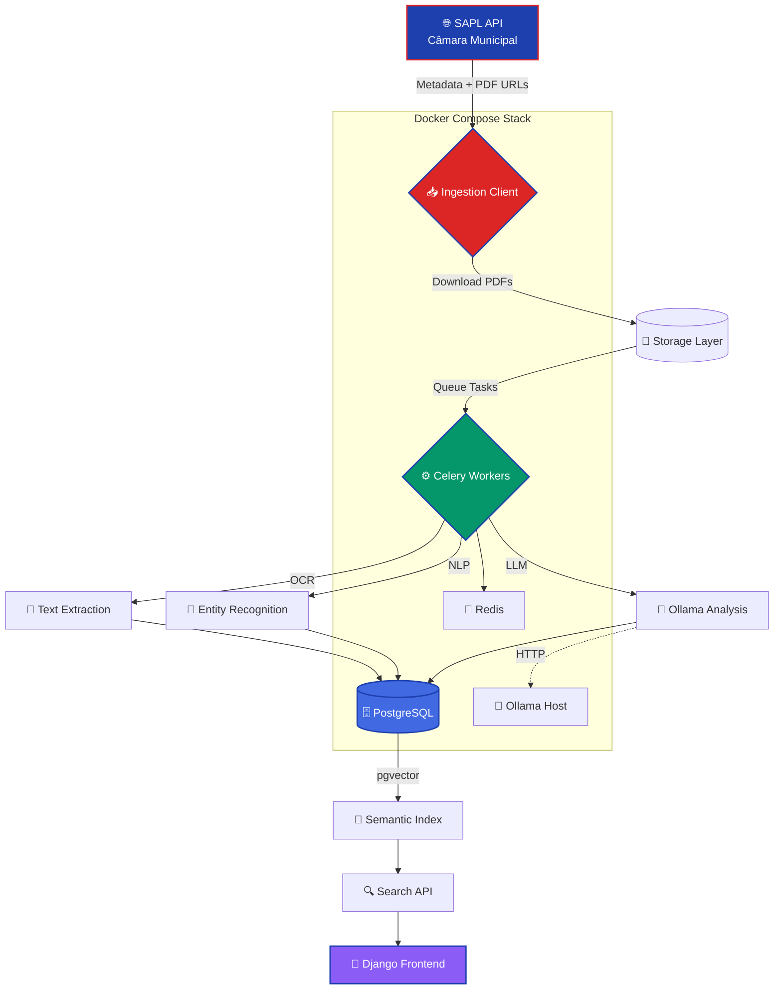

<div align="center">
  
  
  <h1>
    
  </h1>
  
  <samp>PIBIC/UFRN · Sistema de Consolidação Normativa e Rastreabilidade Jurídica</samp>
  <br/><br/>
  
  
  
  
  
  
</div>

<br/>

## `> system.overview()`

```python
class Jurix:
    def __init__(self):
        self.name = "Jurix"
        self.tagline = "Sistema de Consolidação Normativa e Rastreabilidade Jurídica Inteligente"
        self.scope = "Legislação Municipal de Natal/RN"
        self.institution = "UFRN"
        self.program = "PIBIC"
        self.python_version = "3.12+"
    
    def architecture(self):
        return {
            "backend": "Django 5.0",
            "database": "PostgreSQL 16 + pgvector",
            "ai_engine": "Ollama (llama3 via host)",
            "task_queue": "Celery + Redis",
            "frontend": "Django Templates + HTMX",
            "deployment": "Docker Compose + WSL 2"
        }
    
    def capabilities(self):
        return [
            {"feature": "Consolidação Normativa", "icon": "📋"},
            {"feature": "Rastreabilidade Jurídica", "icon": "🔍"},
            {"feature": "Ingestão Automatizada (SAPL)", "icon": "📥"},
            {"feature": "OCR + NLP Processing", "icon": "🧠"},
            {"feature": "Vetorização Semântica", "icon": "🎯"}
        ]
    
    def differentiators(self):
        return [
            "Integração SAPL: Cliente API para câmaras municipais",
            "pgvector: Busca semântica em legislação",
            "Ollama Local: IA sem dependência de APIs externas",
            "Celery Pipeline: Processamento assíncrono em larga escala",
            "Docker-first: Deploy reproduzível em qualquer ambiente",
            "OCR Inteligente: Extração de texto de PDFs legados"
        ]
```

<br/>

## `> tech_stack`

<div align="center">
  
</div>

<table align="center">
<tr>
<td align="center" width="33%">
<strong>🎯 Backend & Database</strong><br/><br/>


</td>
<td align="center" width="33%">
<strong>🤖 AI & Processing</strong><br/><br/>


</td>
<td align="center" width="33%">
<strong>⚡ Infrastructure</strong><br/><br/>


</td>
</tr>
</table>

<br/>

## `> architecture_flow`

<div align="center">



</div>

<br/>

## `> project_structure`

```
jurix/
│
├── 🐳 docker/
│   └── Dockerfile              # Dockerfile para serviços Django
│
├── ⚙️ config/
│   ├── settings.py             # Configurações do projeto
│   ├── urls.py                 # Roteamento global
│   └── celery.py               # Configuração do Celery
│
├── 📦 src/
│   ├── apps/
│   │   ├── core/               # Modelos e lógica base
│   │   ├── ingestion/          # Lógica de ingestão de dados (SAPL)
│   │   └── legislation/        # Domínio principal da legislação
│   │
│   ├── clients/
│   │   └── sapl/               # Cliente para a API do SAPL
│   │
│   ├── llm_engine/             # Integração com Ollama (LLM)
│   │
│   └── processing/             # Lógica de processamento de dados
│
├── 📊 data/                    # Dados não versionados (.gitignore)
│   ├── logs/
│   └── raw/
│
├── 📄 docs/
│   └── SETUP.md                # Documentação de setup
│
├── 🐳 docker-compose.yml       # Orquestração dos containers
├── 📝 manage.py                # Django CLI
├── 📦 requirements.txt         # Dependências Python
└── 📖 README.md
```

<br/>

## `> installation`

### Prerequisites

<table align="center">
<tr>
<td align="center">
<br/>
<samp>Docker Desktop + WSL 2</samp>
</td>
<td align="center">
<br/>
<samp>Ollama com modelo llama3</samp>
</td>
<td align="center">
<br/>
<samp>Python 3.12+ (dev local)</samp>
</td>
<td align="center">
<br/>
<samp>Provido via Docker</samp>
</td>
</tr>
</table>

### Quick Start

```bash
# 1. Clone o repositório
git clone https://github.com/seu-usuario/jurix.git
cd jurix

# 2. Configure Ollama no host
# No Windows (PowerShell como Administrador):
ollama pull llama3
# Depois habilite "Expose Ollama to the network" nas configurações

# 3. Configure variáveis de ambiente
cp .env.example .env
# Edite .env com suas configurações:
# OLLAMA_HOST=http://host.docker.internal:11434
# SAPL_API_URL=https://camaranatal.rn.gov.br/sapl/api/
# POSTGRES_PASSWORD=seu_password_seguro

# 4. Build e inicie os containers
docker-compose up --build

# 5. Aguarde inicialização completa
# Verifique logs: docker-compose logs -f web

# 6. Execute migrações iniciais (em outro terminal)
docker-compose exec web python manage.py migrate

# 7. Crie superusuário
docker-compose exec web python manage.py createsuperuser

# 8. Acesse o sistema
# Admin: http://localhost:8000/admin
# API: http://localhost:8000/api
```

### Verificação de Instalação

```bash
# Teste conectividade Ollama
curl http://localhost:11434/api/version

# Verifique containers ativos
docker-compose ps

# Teste worker Celery
docker-compose exec worker celery -A config inspect ping

# Acesse PostgreSQL
docker-compose exec db psql -U jurix -d jurix_db
```

<br/>

## `> development_workflow`

### Comandos Essenciais

```bash
# 🔄 Gerenciamento de Containers
docker-compose up -d              # Inicia em background
docker-compose down               # Para todos os serviços
docker-compose restart web        # Reinicia Django
docker-compose logs -f worker     # Logs do Celery em tempo real

# 🗄️ Database Management
docker-compose exec web python manage.py makemigrations
docker-compose exec web python manage.py migrate
docker-compose exec web python manage.py dbshell

# 🧹 Manutenção
docker-compose exec web python manage.py shell_plus  # Django shell avançado
docker-compose exec web python manage.py createsuperuser
docker-compose exec web python manage.py collectstatic --noinput

# 🧪 Testing
docker-compose exec web pytest tests/
docker-compose exec web python manage.py test --parallel

# 📊 Monitoring
docker-compose exec web python manage.py show_urls  # Lista todas as rotas
docker-compose exec worker celery -A config inspect stats  # Status Celery
```

### Desenvolvimento Local (Sem Docker)

```bash
# 1. Crie ambiente virtual
python3.12 -m venv venv
source venv/bin/activate  # Linux/Mac
venv\Scripts\activate     # Windows

# 2. Instale dependências
pip install -r requirements/development.txt

# 3. Configure PostgreSQL local + pgvector
createdb jurix_db
psql jurix_db -c "CREATE EXTENSION vector;"

# 4. Execute migrations
python manage.py migrate

# 5. Inicie servidor de desenvolvimento
python manage.py runserver

# 6. (Terminal separado) Inicie Celery worker
celery -A config worker -l info
```

<br/>

## `> sprint_roadmap`

<div align="center">

### 📋 Sprint 1: Infraestrutura Base


</div>

<table align="center">
<tr>
<td align="center"><strong>Task</strong></td>
<td align="center"><strong>Status</strong></td>
<td align="center"><strong>Priority</strong></td>
</tr>
<tr>
<td align="center">🐳 Docker Compose Setup</td>
<td align="center">✅ Completo</td>
<td align="center">🔴 Alta</td>
</tr>
<tr>
<td align="center">🗄️ PostgreSQL + pgvector</td>
<td align="center">✅ Completo</td>
<td align="center">🔴 Alta</td>
</tr>
<tr>
<td align="center">⚙️ Celery + Redis</td>
<td align="center">✅ Completo</td>
<td align="center">🔴 Alta</td>
</tr>
<tr>
<td align="center">🤖 Ollama Integration</td>
<td align="center">✅ Completo</td>
<td align="center">🔴 Alta</td>
</tr>
<tr>
<td align="center">📦 Models (Core + Legislation)</td>
<td align="center">✅ Completo</td>
<td align="center">🔴 Alta</td>
</tr>
<tr>
<td align="center">🌐 Cliente SAPL API</td>
<td align="center">🔄 Em Desenvolvimento</td>
<td align="center">🟡 Média</td>
</tr>
<tr>
<td align="center">📥 Ingestão de teste (50 PDFs)</td>
<td align="center">⏳ Pendente</td>
<td align="center">🟡 Média</td>
</tr>
<tr>
<td align="center">📄 OCR Pipeline</td>
<td align="center">⏳ Pendente</td>
<td align="center">🟢 Baixa</td>
</tr>
</table>

### Próximos Sprints

<table align="center">
<tr>
<td align="center" width="33%">
<strong>📊 Sprint 2</strong><br/><br/>
<samp>
• Pipeline OCR completo<br/>
• NLP entity recognition<br/>
• Vetorização pgvector<br/>
• API REST básica
</samp>
</td>
<td align="center" width="33%">
<strong>🎯 Sprint 3</strong><br/><br/>
<samp>
• Busca semântica<br/>
• Consolidação normativa<br/>
• Rastreabilidade jurídica<br/>
• Interface Django Admin
</samp>
</td>
<td align="center" width="33%">
<strong>🚀 Sprint 4</strong><br/><br/>
<samp>
• Frontend HTMX<br/>
• Dashboard analytics<br/>
• Otimização performance<br/>
• Deploy produção
</samp>
</td>
</tr>
</table>

<br/>

## `> key_features`

<table align="center">
<tr>
<td align="center" width="25%">
<strong>🔍 Busca Semântica</strong><br/><br/>
<samp>
pgvector + embeddings Ollama para busca por <strong>similaridade conceitual</strong>, não apenas palavras-chave.
</samp>
</td>
<td align="center" width="25%">
<strong>📋 Consolidação</strong><br/><br/>
<samp>
Rastreamento automático de <strong>alterações, revogações e vigência</strong> de normas municipais.
</samp>
</td>
<td align="center" width="25%">
<strong>⚡ Processamento Assíncrono</strong><br/><br/>
<samp>
Celery workers para <strong>ingestão massiva</strong> de PDFs sem bloquear interface.
</samp>
</td>
<td align="center" width="25%">
<strong>🤖 IA Local</strong><br/><br/>
<samp>
Ollama hospedado localmente. <strong>Zero dependência</strong> de APIs pagas externas.
</samp>
</td>
</tr>
</table>

### Diferenciais Técnicos

<div align="center">

| Feature | Descrição | Status |
|---------|-----------|--------|
| **SAPL Integration** | Cliente para API oficial de câmaras municipais | 🔄 Em Desenvolvimento |
| **OCR Inteligente** | Tesseract + pré-processamento de imagem | ⏳ Planejado |
| **NLP Pipeline** | spaCy para extração de entidades jurídicas | ⏳ Planejado |
| **pgvector Search** | Busca vetorial com PostgreSQL nativo | ✅ Implementado |
| **Celery Pipeline** | Processamento distribuído e escalável | ✅ Implementado |
| **Docker-first** | Deploy reproduzível em qualquer ambiente | ✅ Implementado |

</div>

<br/>

## `> configuration`

### Variáveis de Ambiente (.env)

```bash
# Django Core
SECRET_KEY=your-secret-key-here
DEBUG=True
ALLOWED_HOSTS=localhost,127.0.0.1

# Database
POSTGRES_DB=jurix_db
POSTGRES_USER=jurix
POSTGRES_PASSWORD=your-secure-password
POSTGRES_HOST=db
POSTGRES_PORT=5432

# Ollama
OLLAMA_HOST=http://host.docker.internal:11434
OLLAMA_MODEL=llama3

# Celery
CELERY_BROKER_URL=redis://redis:6379/0
CELERY_RESULT_BACKEND=redis://redis:6379/0

# SAPL API
SAPL_API_URL=https://camaranatal.rn.gov.br/sapl/api/
SAPL_API_TOKEN=  # Opcional, se houver autenticação

# Storage
MEDIA_ROOT=/app/data/media
STATIC_ROOT=/app/staticfiles
```

### Configuração Ollama (Windows)

```powershell
# 1. Instale Ollama
winget install Ollama.Ollama

# 2. Baixe modelo llama3
ollama pull llama3

# 3. Habilite acesso via rede
# Settings → Expose Ollama to the network (ON)

# 4. Teste conectividade
curl http://localhost:11434/api/version

# 5. No Docker Compose, use host.docker.internal
# OLLAMA_HOST=http://host.docker.internal:11434
```

<br/>

## `> docker_architecture`

### Serviços Docker Compose

```yaml
services:
  # 🗄️ PostgreSQL com pgvector
  db:
    image: pgvector/pgvector:pg16
    volumes:
      - postgres_data:/var/lib/postgresql/data
    environment:
      POSTGRES_DB: jurix_db
      POSTGRES_USER: jurix
      POSTGRES_PASSWORD: ${POSTGRES_PASSWORD}
  
  # 🔴 Redis (Celery broker)
  redis:
    image: redis:7-alpine
    command: redis-server --appendonly yes
  
  # 🌐 Django Web Server
  web:
    build:
      context: .
      dockerfile: docker/web.Dockerfile
    command: gunicorn config.wsgi:application --bind 0.0.0.0:8000
    volumes:
      - ./src:/app/src
      - ./data:/app/data
    ports:
      - "8000:8000"
    depends_on:
      - db
      - redis
  
  # ⚙️ Celery Worker
  worker:
    build:
      context: .
      dockerfile: docker/worker.Dockerfile
    command: celery -A config worker -l info
    volumes:
      - ./src:/app/src
      - ./data:/app/data
    depends_on:
      - db
      - redis
```

<br/>

## `> troubleshooting`

### Problemas Comuns

<table align="center">
<tr>
<td align="center"><strong>Problema</strong></td>
<td align="center"><strong>Solução</strong></td>
</tr>
<tr>
<td align="center">🚫 Ollama não responde</td>
<td align="center">Verifique "Expose to network" nas configurações</td>
</tr>
<tr>
<td align="center">⚠️ Erro de conexão PostgreSQL</td>
<td align="center">Aguarde 30s após <code>docker-compose up</code></td>
</tr>
<tr>
<td align="center">🔐 Permission denied (volumes)</td>
<td align="center">Execute <code>chmod -R 777 data/</code> (dev only)</td>
</tr>
<tr>
<td align="center">📦 ModuleNotFoundError</td>
<td align="center">Rebuild containers: <code>docker-compose up --build</code></td>
</tr>
<tr>
<td align="center">🔄 Celery tasks não executam</td>
<td align="center">Verifique logs: <code>docker-compose logs worker</code></td>
</tr>
</table>

### Debug Avançado

```bash
# 🔍 Inspecione container
docker-compose exec web bash
docker-compose exec worker bash

# 📊 Monitore recursos
docker stats

# 🗄️ Acesse banco diretamente
docker-compose exec db psql -U jurix -d jurix_db

# 🤖 Teste Ollama manualmente
docker-compose exec web python -c "
from llm_engine.ollama_client import OllamaClient
client = OllamaClient()
print(client.generate('Teste de conexão'))
"

# 📝 Logs estruturados
docker-compose logs --tail=100 -f web worker
```

<br/>

## `> academic_context`

**Projeto de Pesquisa:**
- **Instituição:** Universidade Federal do Rio Grande do Norte (UFRN)
- **Programa:** PIBIC (Programa Institucional de Bolsas de Iniciação Científica)
- **Área:** Ciência da Computação / Inteligência Artificial Aplicada ao Direito
- **Objetivo:** Desenvolver sistema de consolidação normativa inteligente para legislação municipal
- **Escopo:** Município de Natal/RN como caso de uso piloto

**Contribuições Científicas:**
1. ✅ Aplicação de NLP em textos jurídicos em português
2. ✅ Uso de embeddings semânticos para busca legislativa
3. ✅ Pipeline de processamento assíncrono para ingestão massiva
4. ✅ Integração com sistemas legados (SAPL)
5. ✅ Rastreabilidade e consolidação automatizada de normas

<br/>

## `> future_enhancements`

<table align="center">
<tr>
<td align="center" width="25%">
<strong>📊 Analytics</strong><br/><br/>
<samp>
• Dashboard de métricas<br/>
• Visualização de grafos<br/>
• Relatórios automatizados
</samp>
</td>
<td align="center" width="25%">
<strong>🔐 Segurança</strong><br/><br/>
<samp>
• Autenticação JWT<br/>
• RBAC (controle de acesso)<br/>
• Auditoria de operações
</samp>
</td>
<td align="center" width="25%">
<strong>🌍 Escalabilidade</strong><br/><br/>
<samp>
• Suporte multi-município<br/>
• Cache distribuído<br/>
• Load balancing
</samp>
</td>
<td align="center" width="25%">
<strong>🤖 IA Avançada</strong><br/><br/>
<samp>
• Sumarização automática<br/>
• Detecção de conflitos<br/>
• Sugestões de consolidação
</samp>
</td>
</tr>
</table>

<br/>

## `> license_and_citation`

<div align="center">


</div>

```bibtex
@misc{jurix2025,
  title        = {Jurix: Sistema de Consolidação Normativa e 
                  Rastreabilidade Jurídica Inteligente},
  author       = {[Seu Nome]},
  year         = {2025},
  institution  = {Universidade Federal do Rio Grande do Norte},
  program      = {PIBIC},
  type         = {Projeto de Iniciação Científica},
  url          = {https://github.com/seu-usuario/jurix}
}
```

<br/>

## `> contact`

<div align="center">
  
  <strong>[Seu Nome]</strong>
  <br/>
  <samp>UFRN - Ciência da Computação</samp>
  <br/>
  <samp>PIBIC - Consolidação Normativa Inteligente</samp>
  
  <br/><br/>
  
  <a href="mailto:seu-email@ufrn.br">
    
  </a>
  <a href="https://github.com/seu-usuario">
    
  </a>
  <a href="https://linkedin.com/in/seu-perfil">
    
  </a>

</div>

<br/>

<div align="center">
  
  
  
</div>


