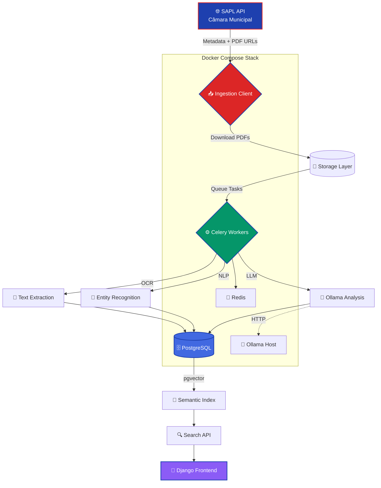

<div align="center">
  
  
  <h1>
    
  </h1>
  
  <samp>PIBIC/UFRN · Sistema de Consolidação Normativa e Rastreabilidade Jurídica</samp>
  <br/><br/>
  
  
  
  
  
  
</div>

<br/>

## `> system.overview()`

```python
class Jurix:
    def __init__(self):
        self.name = "Jurix"
        self.tagline = "Sistema de Consolidação Normativa e Rastreabilidade Jurídica Inteligente"
        self.scope = "Legislação Municipal de Natal/RN"
        self.institution = "UFRN"
        self.program = "PIBIC"
        self.python_version = "3.12+"
    
    def architecture(self):
        return {
            "backend": "Django 5.0",
            "database": "PostgreSQL 16 + pgvector",
            "ai_engine": "Ollama (llama3 via host)",
            "task_queue": "Celery + Redis",
            "frontend": "Django Templates + HTMX",
            "deployment": "Docker Compose + WSL 2"
        }
    
    def capabilities(self):
        return [
            {"feature": "Consolidação Normativa", "icon": "📋"},
            {"feature": "Rastreabilidade Jurídica", "icon": "🔍"},
            {"feature": "Ingestão Automatizada (SAPL)", "icon": "📥"},
            {"feature": "OCR + NLP Processing", "icon": "🧠"},
            {"feature": "Vetorização Semântica", "icon": "🎯"},
            {"feature": "Chatbot RAG", "icon": "💬"}
        ]
    
    def differentiators(self):
        return [
            "Integração SAPL: Cliente API para câmaras municipais",
            "pgvector: Busca semântica em legislação",
            "Ollama Local: IA sem dependência de APIs externas",
            "Celery Pipeline: Processamento assíncrono em larga escala",
            "Docker-first: Deploy reproduzível em qualquer ambiente",
            "OCR Inteligente: Extração de texto de PDFs legados"
        ]
```

<br/>

## `> tech_stack`

<div align="center">
  
</div>

<table align="center">
<tr>
<td align="center" width="33%">
<strong>🎯 Backend & Database</strong><br/><br/>


</td>
<td align="center" width="33%">
<strong>🤖 AI & Processing</strong><br/><br/>


</td>
<td align="center" width="33%">
<strong>⚡ Infrastructure</strong><br/><br/>


</td>
</tr>
</table>

<br/>

## `> architecture_flow`

<div align="center">


```mermaid
graph TD
    A[🌐 SAPL API<br/>Câmara Municipal] -->|Metadata + PDF URLs| B{📥 Ingestion Client}
    B -->|Download PDFs| C[(📂 Storage Layer)]
    C -->|Queue Tasks| D{⚙️ Celery Workers}
    
    D -->|OCR| E[📄 Text Extraction]
    D -->|NLP| F[🧠 Entity Recognition]
    D -->|LLM| G[🤖 Ollama Analysis]
    
    E --> H[(🗄️ PostgreSQL)]
    F --> H
    G --> H
    
    H -->|pgvector| I[🎯 Semantic Index]
    I --> J[🔍 Search API]
    J --> K[📱 Django Frontend]
    
    subgraph "Docker Compose Stack"
    B
    D
    H
    L[🔴 Redis]
    M[🤖 Ollama Host]
    end
    
    D --> L
    G -.->|HTTP| M
    
    style A fill:#1e40af,stroke:#dc2626,stroke-width:2px,color:#fff
    style B fill:#dc2626,stroke:#1e40af,stroke-width:2px,color:#fff
    style D fill:#059669,stroke:#1e40af,stroke-width:2px,color:#fff
    style H fill:#4169E1,stroke:#1e40af,stroke-width:2px,color:#fff
    style K fill:#8B5CF6,stroke:#1e40af,stroke-width:2px,color:#fff
```

</div>

<br/>

## `> project_structure`

```
jurix/
│
├── 🐳 docker/
│   └── Dockerfile                  # Multi-stage build (Python 3.12, OCR, Poppler, Curl)
│
├── ⚙️ config/
│   ├── settings.py                 # Configurações Django unificadas (Database, Redis, Ollama, Celery)
│   ├── urls.py                     # Roteamento global de URLs
│   ├── wsgi.py                     # Entrypoint WSGI Gunicorn
│   └── celery.py                   # Configuração do Celery worker/broker
│
├── 📦 src/
│   ├── apps/
│   │   ├── core/                   # Utilitários, modelos base e assets estáticos
│   │   │   ├── static/             # Swiss Design CSS, vendor local JS (marked, DOMPurify) e chat.js
│   │   │   └── models.py           # TimeStampedModel base
│   │   │
│   │   ├── legislation/            # Domínio jurídico e RAG
│   │   │   ├── models.py           # Norma, Dispositivo, ChatSession, ChatMessage
│   │   │   ├── views.py            # NormaListView, NormaDetailView, ChatbotView
│   │   │   ├── serializers.py      # Serialização desacoplada de dispositivos e sessões
│   │   │   ├── api_views.py        # Endpoints REST (Busca, RAG SSE Streaming, Health)
│   │   │   ├── api_urls.py         # Rotas /api/v1/
│   │   │   └── admin.py            # Django Admin customizado
│   │   │
│   │   └── ingestion/              # Ingestão e pipeline assíncrono
│   │       ├── models.py           # IngestionTask, RawDocument
│   │       └── tasks.py            # Tarefas Celery atômicas (download, OCR, segmentação)
│   │
│   ├── clients/
│   │   └── sapl/
│   │       └── sapl_client.py      # Cliente HTTP SAPL com URL configurável
│   │
│   ├── processing/
│   │   ├── legal_parser.py         # Segmentação hierárquica (Artigos, Parágrafos, Macro-divisões)
│   │   ├── ner_extractor.py        # Extração de referências jurídicas e entidades
│   │   ├── consolidation_engine.py # Motor de rastreamento de vigência e revogações
│   │   └── rag_service.py          # RAG Service, pgvector Cosine similarity e streaming
│   │
│   ├── llm_engine/
│   │   ├── ollama_service.py       # Ollama Service (Connection Pooling, Embeddings, SSE Stream)
│   │   └── prompts.py              # Templates de prompts para assistente jurídico
│   │
│   └── tests/                      # Suite de testes unitários e de integração
│       ├── conftest.py
│       ├── test_legal_parser.py
│       ├── test_models.py
│       ├── test_views.py
│       ├── test_api.py
│       └── ...
│
├── 📊 data/                        # Dados locais (não versionados)
│   ├── pdfs/                       # PDFs baixados do SAPL
│   └── media/                      # Uploads de documentos
│
├── 🔐 .env.example                 # Variáveis de ambiente de referência
├── 🐳 docker-compose.yml           # Stack: jurix_web, jurix_worker, jurix_db, jurix_redis
├── 📜 pyproject.toml               # Configuração do Ruff (Python 3.12) e metadados
├── 🧪 pytest.ini                   # Configurações do Pytest (Django, coverage)
├── 📦 requirements.txt             # Dependências de produção e qualidade
├── 📝 manage.py                    # Django CLI
├── 📄 LICENSE                      # Licença MIT
└── 📖 README.md
```

<br/>

## `> installation`

### Prerequisites

<table align="center">
<tr>
<td align="center">
<br/>
<samp>Docker Desktop + WSL 2</samp>
</td>
<td align="center">
<br/>
<samp>Ollama com modelo llama3</samp>
</td>
<td align="center">
<br/>
<samp>Python 3.12+ (dev local)</samp>
</td>
<td align="center">
<br/>
<samp>Provido via Docker</samp>
</td>
</tr>
</table>

### Quick Start

```bash
# 1. Clone o repositório
git clone https://github.com/takaokensei/jurix.git
cd jurix

# 2. Configure Ollama no host
# No Windows (PowerShell como Administrador):
ollama pull llama3
# Depois habilite "Expose Ollama to the network" nas configurações

# 3. Configure variáveis de ambiente
cp .env.example .env
# Edite .env com suas configurações:
# OLLAMA_BASE_URL=http://host.docker.internal:11434
# SAPL_API_URL=https://camaranatal.rn.gov.br/sapl/api/
# POSTGRES_PASSWORD=seu_password_seguro

# 4. Build e inicie os containers
docker-compose up --build

# 5. Aguarde inicialização completa
# Verifique logs: docker-compose logs -f web

# 6. Execute migrações iniciais (em outro terminal)
docker-compose exec web python manage.py migrate

# 7. Crie superusuário
docker-compose exec web python manage.py createsuperuser

# 8. Acesse o sistema
# Django Admin: http://localhost:8000/admin
# Chatbot RAG: http://localhost:8000/normas/chatbot/
# Lista de Normas: http://localhost:8000/normas/
# API REST: http://localhost:8000/api/v1/
```

### Verificação de Instalação

```bash
# Teste conectividade Ollama
curl http://localhost:11434/api/version

# Verifique containers ativos
docker-compose ps

# Teste worker Celery
docker-compose exec worker celery -A config inspect ping

# Acesse PostgreSQL
docker-compose exec db psql -U jurix -d jurix_db
```

<br/>

## `> development_workflow`

### Comandos Essenciais

```bash
# 🔄 Gerenciamento de Containers
docker-compose up -d              # Inicia em background
docker-compose down               # Para todos os serviços
docker-compose restart web        # Reinicia Django
docker-compose logs -f worker     # Logs do Celery em tempo real

# 🗄️ Database Management
docker-compose exec web python manage.py makemigrations
docker-compose exec web python manage.py migrate
docker-compose exec web python manage.py dbshell

# 🧹 Manutenção
docker-compose exec web python manage.py shell_plus  # Django shell avançado
docker-compose exec web python manage.py createsuperuser
docker-compose exec web python manage.py collectstatic --noinput

# 🧪 Testing
docker-compose exec web pytest src/tests/
docker-compose exec web python manage.py test --parallel

# 📊 Monitoring
docker-compose exec web python manage.py show_urls  # Lista todas as rotas
docker-compose exec worker celery -A config inspect stats  # Status Celery
```

### Desenvolvimento Local (Sem Docker)

```bash
# 1. Crie ambiente virtual
python3.12 -m venv venv
source venv/bin/activate  # Linux/Mac
venv\Scripts\activate     # Windows

# 2. Instale dependências
pip install -r requirements.txt

# 3. Configure PostgreSQL local + pgvector
createdb jurix_db
psql jurix_db -c "CREATE EXTENSION vector;"

# 4. Execute migrations
python manage.py migrate

# 5. Inicie servidor de desenvolvimento
python manage.py runserver

# 6. (Terminal separado) Inicie Celery worker
celery -A config worker -l info
```

<br/>

## `> sprint_roadmap`

<div align="center">

### 📋 Sprint 1: Infraestrutura Base


</div>

<table align="center">
<tr>
<td align="center"><strong>Task</strong></td>
<td align="center"><strong>Status</strong></td>
<td align="center"><strong>Priority</strong></td>
</tr>
<tr>
<td align="center">🐳 Docker Compose Setup</td>
<td align="center">✅ Completo</td>
<td align="center">🔴 Alta</td>
</tr>
<tr>
<td align="center">🗄️ PostgreSQL + pgvector</td>
<td align="center">✅ Completo</td>
<td align="center">🔴 Alta</td>
</tr>
<tr>
<td align="center">⚙️ Celery + Redis</td>
<td align="center">✅ Completo</td>
<td align="center">🔴 Alta</td>
</tr>
<tr>
<td align="center">🤖 Ollama Integration</td>
<td align="center">✅ Completo</td>
<td align="center">🔴 Alta</td>
</tr>
<tr>
<td align="center">📦 Models (Core + Legislation)</td>
<td align="center">✅ Completo</td>
<td align="center">🔴 Alta</td>
</tr>
<tr>
<td align="center">🌐 Cliente SAPL API</td>
<td align="center">✅ Completo</td>
<td align="center">🔴 Alta</td>
</tr>
<tr>
<td align="center">📥 Ingestão de normas</td>
<td align="center">✅ Completo</td>
<td align="center">🔴 Alta</td>
</tr>
<tr>
<td align="center">📄 OCR Pipeline</td>
<td align="center">✅ Completo</td>
<td align="center">🟡 Média</td>
</tr>
</table>

### 🚀 Sprint 2-3: IA e RAG

<div align="center">


</div>

<table align="center">
<tr>
<td align="center"><strong>Task</strong></td>
<td align="center"><strong>Status</strong></td>
</tr>
<tr>
<td align="center">🎯 Busca Semântica (pgvector)</td>
<td align="center">✅ Completo</td>
</tr>
<tr>
<td align="center">💬 Chatbot RAG (Ollama + Llama3)</td>
<td align="center">✅ Completo</td>
</tr>
<tr>
<td align="center">🔍 Segmentação Hierárquica (Multiline Fix)</td>
<td align="center">✅ Completo</td>
</tr>
<tr>
<td align="center">📊 Embeddings Vetoriais</td>
<td align="center">✅ Completo</td>
</tr>
<tr>
<td align="center">🎨 Swiss Design System UI/UX</td>
<td align="center">✅ Completo</td>
</tr>
<tr>
<td align="center">⌨️ Command Palette (⌘K)</td>
<td align="center">✅ Completo</td>
</tr>
<tr>
<td align="center">🌓 Dark/Light Theme System</td>
<td align="center">✅ Completo</td>
</tr>
<tr>
<td align="center">♿ Acessibilidade WCAG 2.1 AA</td>
<td align="center">✅ Completo</td>
</tr>
</table>

### 📊 Status Atual do Projeto

<div align="center">

**356+ Normas** processadas | **5.463+ Dispositivos Legais** indexados | **1990-2025**

</div>

### 🎨 Release 1.1.0 - Swiss Design UI/UX

**Lançado:** Janeiro 2025  
**Principais Melhorias:**
- Sistema de Design completo baseado em Swiss Design
- Interface chatbot modernizada (workspace layout, input transparente estilo Gemini)
- Command Palette para navegação rápida
- Theme system (dark/light mode)
- Melhorias de acessibilidade (WCAG 2.1 AA)
- Animações suaves e profissionais
- Copy response button (Markdown clipboard)
- Suporte a Markdown em perguntas do usuário

### Próximos Sprints

<table align="center">
<tr>
<td align="center" width="50%">
<strong>🧠 Sprint 4: Consolidação Inteligente</strong><br/><br/>
<samp>
• Engine de consolidação temporal<br/>
• Detecção automática de alterações<br/>
• Rastreabilidade jurídica completa<br/>
• Visualização comparada de versões
</samp>
</td>
<td align="center" width="50%">
<strong>🚀 Sprint 5: Otimização & Deploy</strong><br/><br/>
<samp>
• Dashboard analytics<br/>
• Otimização de performance<br/>
• Fine-tuning do modelo Llama3<br/>
• Deploy produção
</samp>
</td>
</tr>
</table>

<br/>

## `> key_features`

<table align="center">
<tr>
<td align="center" width="20%">
<strong>💬 Chatbot RAG</strong><br/><br/>
<samp>
Assistente jurídico com <strong>RAG (Retrieval-Augmented Generation)</strong> usando Llama3 local. Responde perguntas sobre legislação com citações precisas.
</samp>
</td>
<td align="center" width="20%">
<strong>🔍 Busca Semântica</strong><br/><br/>
<samp>
pgvector + embeddings para busca por <strong>similaridade conceitual</strong>, não apenas palavras-chave.
</samp>
</td>
<td align="center" width="20%">
<strong>📋 Consolidação</strong><br/><br/>
<samp>
Rastreamento automático de <strong>alterações, revogações e vigência</strong> de normas municipais.
</samp>
</td>
<td align="center" width="20%">
<strong>⚡ Processamento Assíncrono</strong><br/><br/>
<samp>
Celery workers para <strong>ingestão massiva</strong> de PDFs sem bloquear interface.
</samp>
</td>
<td align="center" width="20%">
<strong>🤖 IA Local</strong><br/><br/>
<samp>
Ollama hospedado localmente. <strong>Zero dependência</strong> de APIs pagas externas.
</samp>
</td>
</tr>
</table>

### Diferenciais Técnicos

<div align="center">

| Feature | Descrição | Status |
|---------|-----------|--------|
| **SAPL Integration** | Cliente para API oficial de câmaras municipais | 🔄 Em Desenvolvimento |
| **OCR Inteligente** | Tesseract + pré-processamento de imagem | ⏳ Planejado |
| **NLP Pipeline** | spaCy para extração de entidades jurídicas | ⏳ Planejado |
| **pgvector Search** | Busca vetorial com PostgreSQL nativo | ✅ Implementado |
| **Celery Pipeline** | Processamento distribuído e escalável | ✅ Implementado |
| **Docker-first** | Deploy reproduzível em qualquer ambiente | ✅ Implementado |

</div>

<br/>

## `> chatbot_rag`

### 💬 Assistente Jurídico Inteligente

O Jurix inclui um **chatbot RAG (Retrieval-Augmented Generation)** que permite consultas em linguagem natural sobre a legislação municipal de Natal/RN. O sistema utiliza:

- **Busca Semântica:** Recupera dispositivos legais relevantes usando embeddings vetoriais (pgvector)
- **Geração com Contexto:** O modelo Llama3 gera respostas baseadas nos dispositivos recuperados
- **Citações Precisas:** Cada resposta inclui referências às fontes legais (norma, artigo, parágrafo)
- **Interface Moderna:** Interface web responsiva com design moderno

### 🎯 Exemplos de Uso

Acesse o chatbot em: `http://localhost:8000/normas/chatbot/`

**Perguntas que o sistema pode responder:**

- "Como funciona o zoneamento urbano em Natal?"
- "Quais as regras para licença de construção?"
- "Quais são os requisitos para aprovação de projetos habitacionais?"
- "Explique as normas sobre uso e ocupação do solo"

### 🔧 API Endpoints

```bash
# Healthcheck do serviço
GET /api/v1/health/

# Busca semântica vetorial (pgvector)
POST /api/v1/search/
Content-Type: application/json
{
  "query": "zoneamento urbano",
  "k": 5
}

# Resposta RAG (Batch / JSON)
POST /api/v1/search/answer/
Content-Type: application/json
{
  "question": "Como funciona o zoneamento?",
  "k": 5,
  "model": "llama3"
}

# Resposta RAG em Tempo Real (Server-Sent Events Streaming)
POST /api/v1/search/answer/stream/
Content-Type: application/json
{
  "session_id": "opcional-uuid-sessao",
  "message": "Quais os requisitos para licença de construção?"
}
```

### 📊 Arquitetura RAG

```
Usuário faz pergunta
    ↓
Busca Semântica (pgvector Cosine Distance 1-d)
    ↓
Top-K dispositivos relevantes com hierarquia materializada
    ↓
Contexto jurídico formatado + Prompt restrito
    ↓
Ollama (Llama3 via Connection Pool HTTP)
    ↓
Streaming SSE em tempo real (token-a-token) + Fontes citadas
```

<br/>

## `> configuration`

### Variáveis de Ambiente (.env)

```bash
# Django Core
SECRET_KEY=your-secret-key-here
DEBUG=True
ALLOWED_HOSTS=localhost,127.0.0.1,jurix_web

# Database (PostgreSQL 16 + pgvector)
DATABASE_URL=postgresql://jurix_user:jurix_pass_dev@db:5432/jurix
POSTGRES_DB=jurix
POSTGRES_USER=jurix_user
POSTGRES_PASSWORD=jurix_pass_dev

# Cache & Celery Broker (Redis)
REDIS_URL=redis://redis:6379/0
# Nota: Para scripts executados diretamente no host Windows (fora do Docker), use:
# REDIS_URL=redis://localhost:16379/0

# Ollama Local LLM
OLLAMA_BASE_URL=http://host.docker.internal:11434
OLLAMA_MODEL=llama3

# SAPL API (Câmara Municipal de Natal/RN)
SAPL_BASE_URL=https://sapl.natal.rn.leg.br/

# Storage
MEDIA_ROOT=/app/data/media
STATIC_ROOT=/app/staticfiles
```

### Configuração Ollama (Host)

```powershell
# 1. Instale Ollama (se ainda não tiver)
winget install Ollama.Ollama

# 2. Baixe modelo llama3
ollama pull llama3

# 3. Inicie o serviço permitindo conexões de rede
# No Windows PowerShell:
$env:OLLAMA_HOST = "0.0.0.0"
ollama serve

# 4. Teste conectividade
curl http://localhost:11434/api/version

# 5. No Docker Compose, os containers acessam via host.docker.internal
# OLLAMA_BASE_URL=http://host.docker.internal:11434
```

<br/>

## `> docker_architecture`

### Serviços Docker Compose

```yaml
services:
  # 🗄️ PostgreSQL 16 com pgvector
  db:
    image: pgvector/pgvector:pg16
    container_name: jurix_db
    environment:
      POSTGRES_DB: ${POSTGRES_DB:-jurix}
      POSTGRES_USER: ${POSTGRES_USER:-jurix_user}
      POSTGRES_PASSWORD: ${POSTGRES_PASSWORD:-jurix_pass_dev}
    volumes:
      - postgres_data:/var/lib/postgresql/data
    ports:
      - "5432:5432"
    healthcheck:
      test: ["CMD-SHELL", "pg_isready -U ${POSTGRES_USER:-jurix_user}"]

  # 🔴 Redis (Broker de Tarefas e Cache)
  redis:
    image: redis:7-alpine
    container_name: jurix_redis
    ports:
      - "16379:6379"  # Mapeamento 16379 no host para evitar conflito no Windows
    volumes:
      - redis_data:/data
    healthcheck:
      test: ["CMD", "redis-cli", "ping"]

  # 🌐 Django Web Application
  web:
    build:
      context: .
      dockerfile: docker/Dockerfile
    container_name: jurix_web
    command: python manage.py runserver 0.0.0.0:8000
    volumes:
      - .:/app
      - ./data:/app/data
    ports:
      - "8000:8000"
    healthcheck:
      test: ["CMD", "python", "-c", "import urllib.request; urllib.request.urlopen('http://localhost:8000/api/v1/health/')"]
    depends_on:
      db:
        condition: service_healthy
      redis:
        condition: service_healthy

  # ⚙️ Celery Ingestion Worker
  worker:
    build:
      context: .
      dockerfile: docker/Dockerfile
    container_name: jurix_worker
    command: celery -A config worker -l info --pool=solo
    volumes:
      - .:/app
      - ./data:/app/data
    depends_on:
      db:
        condition: service_healthy
      redis:
        condition: service_healthy
```

<br/>

## `> troubleshooting`

### Problemas Comuns

<table align="center">
<tr>
<td align="center"><strong>Problema</strong></td>
<td align="center"><strong>Solução</strong></td>
</tr>
<tr>
<td align="center">🚫 Ollama não responde</td>
<td align="center">Verifique "Expose to network" nas configurações</td>
</tr>
<tr>
<td align="center">⚠️ Erro de conexão PostgreSQL</td>
<td align="center">Aguarde 30s após <code>docker-compose up</code></td>
</tr>
<tr>
<td align="center">🔐 Permission denied (volumes)</td>
<td align="center">Execute <code>chmod -R 777 data/</code> (dev only)</td>
</tr>
<tr>
<td align="center">📦 ModuleNotFoundError</td>
<td align="center">Rebuild containers: <code>docker-compose up --build</code></td>
</tr>
<tr>
<td align="center">🔄 Celery tasks não executam</td>
<td align="center">Verifique logs: <code>docker-compose logs worker</code></td>
</tr>
</table>

### Debug Avançado

```bash
# 🔍 Inspecione container
docker-compose exec web bash
docker-compose exec worker bash

# 📊 Monitore recursos
docker stats

# 🗄️ Acesse banco diretamente
docker-compose exec db psql -U jurix -d jurix_db

# 🤖 Teste Ollama manualmente
docker-compose exec web python -c "
from src.llm_engine.ollama_service import OllamaService
service = OllamaService(model='llama3')
print(service.generate_text('Teste de conexão'))
"

# 📝 Logs estruturados
docker-compose logs --tail=100 -f web worker
```

<br/>

## `> academic_context`

**Projeto de Pesquisa:**
- **Instituição:** Universidade Federal do Rio Grande do Norte (UFRN)
- **Programa:** PIBIC (Programa Institucional de Bolsas de Iniciação Científica)
- **Área:** Engenharia Elétrica / Inteligência Artificial Aplicada ao Direito
- **Objetivo:** Desenvolver sistema de consolidação normativa inteligente para legislação municipal
- **Escopo:** Município de Natal/RN como caso de uso piloto

**Contribuições Científicas:**
1. ✅ Aplicação de NLP em textos jurídicos em português
2. ✅ Uso de embeddings semânticos para busca legislativa
3. ✅ Pipeline de processamento assíncrono para ingestão massiva
4. ✅ Integração com sistemas legados (SAPL)
5. ✅ Rastreabilidade e consolidação automatizada de normas

<br/>

## `> future_enhancements`

<table align="center">
<tr>
<td align="center" width="25%">
<strong>📊 Analytics</strong><br/><br/>
<samp>
• Dashboard de métricas<br/>
• Visualização de grafos<br/>
• Relatórios automatizados
</samp>
</td>
<td align="center" width="25%">
<strong>🔐 Segurança</strong><br/><br/>
<samp>
• Autenticação JWT<br/>
• RBAC (controle de acesso)<br/>
• Auditoria de operações
</samp>
</td>
<td align="center" width="25%">
<strong>🌍 Escalabilidade</strong><br/><br/>
<samp>
• Suporte multi-município<br/>
• Cache distribuído<br/>
• Load balancing
</samp>
</td>
<td align="center" width="25%">
<strong>🤖 IA Avançada</strong><br/><br/>
<samp>
• Sumarização automática<br/>
• Detecção de conflitos<br/>
• Sugestões de consolidação
</samp>
</td>
</tr>
</table>

<br/>

## `> license_and_citation`

<div align="center">


</div>

```bibtex
@misc{jurix2025,
  title        = {Jurix: Sistema de Consolidação Normativa e 
                  Rastreabilidade Jurídica Inteligente},
  author       = {Cauã Vitor F. Silva},
  year         = {2025},
  institution  = {Universidade Federal do Rio Grande do Norte},
  program      = {PIBIC},
  type         = {Projeto de Iniciação Científica},
  url          = {https://github.com/takaokensei/jurix}
}
```

<br/>

## `> contact`

<div align="center">
  
  <strong>Cauã Vitor F. Silva</strong>
  <br/>
  <samp>UFRN - Engenharia Elétrica</samp>
  <br/>
  <samp>PIBIC - Consolidação Normativa Inteligente</samp>
  
  <br/><br/>
  
  <a href="mailto:cauavitorfigueredo@gmail.com">
    
  </a>
  <a href="https://github.com/takaokensei">
    
  </a>
  <a href="https://linkedin.com/in/cauã-vitor-7bb072286">
    
  </a>

</div>

<br/>

<div align="center">
  
  
  
</div>

---

## 🏁 Project Status

**Status:** 🚀 **In Active Development**  
**Version:** 1.1.0 - Swiss Design UI/UX Release  
**Current Focus:** Swiss Design System Implementation & UI Polish  

### 📊 Estatísticas do Sistema

- **356+ Normas** processadas e consolidadas (período 1990-2025)
- **5.463+ Dispositivos Legais** indexados com embeddings vetoriais
- **Sistema RAG** funcional com modelo Llama3 local
- **Interface Web Premium** com Swiss Design System

### 🎯 Funcionalidades Principais Implementadas

✅ **Ingestão Automatizada** via API SAPL da Câmara Municipal de Natal  
✅ **OCR Pipeline** completo com Tesseract  
✅ **Segmentação Hierárquica** refinada (suporte multiline, captura completa de texto)  
✅ **Busca Semântica** com pgvector e embeddings  
✅ **Chatbot RAG** com resposta em linguagem natural e citação de fontes  
✅ **Interface Web Premium** com Swiss Design System  
✅ **Command Palette** (⌘K/Ctrl+K) para navegação rápida  
✅ **Dark/Light Mode** com persistência e detecção automática  
✅ **Copy Response** button (Markdown clipboard)  
✅ **Markdown Support** em perguntas do usuário  

### 🎨 Novidades da Versão 1.1.0 (Swiss Design Release)

Esta versão traz uma **modernização completa da interface** seguindo os princípios do **Swiss Design System**:

- **🎨 Design System Completo**: Design tokens (cores, tipografia, espaçamento 8px grid), tipografia Inter + JetBrains Mono
- **💬 Chatbot Reimaginado**: Layout workspace, sidebar colapsável, input transparente estilo Gemini, animações suaves
- **⌨️ Command Palette**: Navegação rápida com ⌘K/Ctrl+K, animações elegantes, ícones SVG profissionais
- **📋 Copy Response**: Botão icon-only para copiar respostas em Markdown
- **🌓 Theme System**: Dark/Light mode com transições suaves, detecção automática de preferência do sistema
- **♿ Acessibilidade**: WCAG 2.1 AA compliance, skip links, focus-visible states, keyboard navigation
- **📱 Responsividade**: Layout adaptativo para mobile, tablet e desktop
- **✨ Animações**: Transições suaves com cubic-bezier, typewriter effect, skeleton screens

### 📈 Progresso do Projeto

**Sprint 1 (Fundação):** ✅ **100% Completo**  
**Sprint 2-3 (IA e RAG):** ✅ **85% Completo**  
**Sprint 4 (Consolidação):** 🔄 **20% Completo** (Em planejamento)  
**Sprint 5 (Otimização):** ⏳ **Aguardando**

**Progresso Geral:** ~**70% do MVP concluído**

**PIBIC Report:** Available in `docs/PIBIC_RELATORIO_FINAL_ESBOCO.md`

This project successfully demonstrates the application of NLP and AI techniques to Brazilian legal texts, maintaining full data sovereignty through local processing, with a modern, professional UI following Swiss Design principles.

---

<div align="center">
  
</div>

