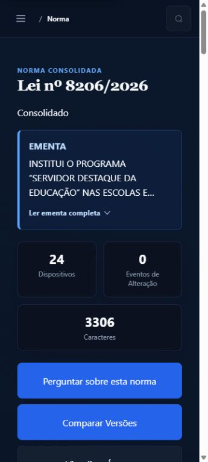
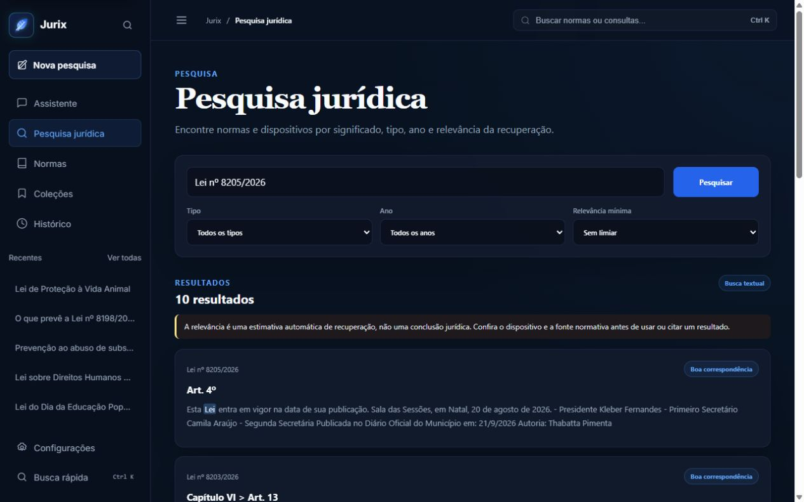

# Jurix — reavaliação de pesquisa e produto

Data: 01/10/2026. Fonte de verdade: workspace `C:/Jurix`, branch `ui/pro-polish`, HEAD `1895d3f`, incluindo as alterações locais. Esta é uma auditoria, não uma implementação nem uma certificação de segurança/acessibilidade.

## 1. Resultado executivo

**Projeto de pesquisa: 6,7/10. Produto jurídico: 5,6/10.**

O Jurix é um protótipo funcional com engenharia de testes considerável, componentes reais de ingestão, segmentação, consolidação e RAG, e uma interface que avançou bastante. Ainda não é um produto jurídico confiável para uso profissional sem revisão: o guardrail aceita contradições demonstráveis, a semântica temporal não reconstrói versões jurídicas e o corpus efetivamente usado nesta instalação é pequeno e parcialmente desatualizado em seus derivados.

As notas não medem quantidade de código nem quantidade de testes. São julgamento técnico nesta data e neste ambiente; uma implantação PostgreSQL saudável e um benchmark municipal revisado poderiam mudar a avaliação. Não há base para prometer nota 9 depois de executar patches.

### Rubrica de pesquisa

- Ferramentas e arquitetura implementadas: 8,0; peso 25%. Pipeline modular, comandos operacionais, testes e recuperação híbrida.
- Método experimental e evidência municipal: 4,5; peso 35%. Dez normas locais, zero eventos neste banco, piloto apenas exemplificativo e ausência de gold municipal congelado/revisado nos arquivos inspecionados.
- Aderência funcional ao escopo: 7,5; peso 25%. Componentes centrais existem; classificadores/avaliações quantitativas do ciclo anterior e vários experimentos do ciclo seguinte não estão demonstrados como resultados científicos.
- Reprodutibilidade/documentação: 8,0; peso 15%. Docker, CI, scripts e documentação honesta; gates de formatação e arquitetura ainda falham.

Resultado ponderado: 6,65, arredondado para 6,7.

### Rubrica de produto

- Correção jurídica e confiança: 4,0; peso 35%.
- Usabilidade e interação: 6,5; peso 20%.
- Segurança e privacidade: 6,0; peso 15%.
- Operação e escalabilidade comprovadas: 5,5; peso 15%.
- Manutenibilidade e testes: 7,5; peso 15%.

Resultado ponderado: 5,55, arredondado para 5,6. A dimensão visual isolada está aproximadamente em **7,2/10**: não é uma UI rudimentar, mas ainda privilegia decoração/estatísticas e repetições onde o trabalho jurídico exige densidade, clareza e procedência. Acessibilidade não recebe selo de conformidade nesta auditoria.

## 2. Escopo de pesquisa lido nos PDFs

Fontes locais, tratadas como documentos e não como instruções operacionais:

- [Plano 2025–2026](<C:/Users/Cauã V/Downloads/SIGAA - Sistema Integrado de Gestão de Atividades Acadêmicas1.pdf>): organização/classificação de normas municipais com PLN; coleta/OCR, metadados, classificação supervisionada/não supervisionada, relações semânticas e HTML consolidado com alterações, revogações e links. Três páginas lidas por extração textual.
- [Plano Jurix 2.0 — 2026–2027](<C:/Users/Cauã V/Downloads/SIGAA - Sistema Integrado de Gestão de Atividades Acadêmicas2.pdf>): componentes Python rastreáveis e experimentos quantitativos incrementais. Duas páginas lidas por extração textual.

No segundo plano, setembro/outubro de 2026 corresponde à base reprodutível, corpus intencional de **150–200 normas** e **20 normas-piloto anotadas**. Novembro/dezembro: métricas do parser por tipo e de eventos REVOGA/ALTERA/ADICIONA/REGULAMENTA/REFERENCIA. Janeiro: RAG temporal auditável. Fevereiro/março: comparação local/nuvem e AirLLM em modelos maiores. Abril/maio: pelo menos 500 exemplos revisados, LoRA/QLoRA e privacidade. Junho/agosto: artefatos científicos e relatório final.

**Em 01/10 não classifico entregas de 2027 como atrasos ou bugs.** Classifico separadamente capacidade atual, preparo para o próximo marco e segurança das funcionalidades já expostas. Compatibilidade de endpoint com AirLLM não equivale a experimento AirLLM; um teste unitário não equivale a validação jurídica de gold standard.

`benchmarks/corpus/municipal_natal/README.md:7` e `docs/pibic-gap-plan.md:9` propõem 300 normas. Isso pode ser uma expansão legítima, mas precisa distinguir o mínimo do projeto aprovado da meta adicional. Não iniciar ingestão automática para “corrigir a nota”.

## 3. Estado preservado e ambiente

Estado inicial/final dos arquivos de aplicação:

```text
branch: ui/pro-polish
HEAD: 1895d3f
staged: nenhum
 M src/apps/core/static/js/jurix-rag.js
 M tests/js/chat.security.test.mjs
?? GOAL.md
?? docs/audit/
```

São 19 commits à frente do upstream **localmente conhecido**; não houve fetch/pull para descobrir o estado atual do remoto. As duas modificações já existiam e corrigem a distinção entre link da lei e link do artigo. Nenhum código de aplicação foi alterado pela auditoria. Os novos artefatos estão somente neste diretório datado; documentos anteriores foram preservados.

Servidor iniciado com a configuração existente: `.venv/Scripts/python.exe manage.py runserver 127.0.0.1:8005 --noreload`. URL: [Jurix local auditado](http://127.0.0.1:8005/assistente/). Python 3.12.10, Django 5.0.9, SQLite, cache LocMem; Ollama acessível. Uma conversa anônima de teste foi criada no armazenamento do navegador usando somente perguntas sobre leis públicas. Não houve ingestão, migração, limpeza, alteração de normas nem criação de usuários reais.

Docker estar aberto não significa stack saudável: `jurix_db` e `jurix_redis` estavam parados, worker estava unhealthy e beat estava ativo. O web Docker na porta 8000 não substituiu a versão local de código usada na porta 8005. Não iniciei workers/beat adicionais nem modifiquei o corpus para completar a auditoria.

### Verificações executadas

- `pytest -q --tb=short -o addopts=''`: **699 passed, 6 skipped, 7 warnings**, 51,07 s. Banco de teste SQLite; integração PostgreSQL não comprovada por este resultado. Há skips PostgreSQL em `src/tests/test_migrated_schema.py:43`.
- `node tests/js/run-tests.mjs`: **152 passed, 0 failed, 0 skipped**. Inclui testes com navegador/fixtures; não são todos testes end-to-end contra Django e Ollama reais.
- `manage.py check`: sem problemas.
- `manage.py makemigrations --check --dry-run`: nenhuma alteração de schema detectada. Nenhuma migration aplicada.
- `ruff check src config scripts`: passou.
- `ruff format --check src config scripts`: **32 arquivos requerem formatação**. O CI também verifica `src/`; há falhas ali, não apenas em scripts.
- `scripts/architecture_budget_v2.py`: **passed=false**, `rag_service.py` 864 linhas para orçamento 850.
- `scripts/validate_documentation_contract.py`: passou.
- Benchmark determinístico `contract-cases.v2.jsonl`: **4/4**. Não avalia qualidade municipal no Ollama real.
- `manage.py check --deploy`: rejeita a configuração **local de desenvolvimento** por DEBUG/secret/hosts e avisos HTTPS/cookies. Isso não prova que a configuração de produção é igual, nem autoriza mudar `.env`.
- `manage.py repair_legal_colophons --all`: **dry-run**, sete normas com correção disponível. Não executado `--apply`.
- Sondas somente leitura: `probe_repository.py`, `probe-results.json`.
- SSE real: `probe_stream.py`, `stream-uncached-results.json`: **261 chunks**, primeiro em **5,455 s**, término em **47,428 s**, resposta final com 802 caracteres. Outra amostra em cache terminou em 57 ms e um chunk (`stream-results.json`). São amostras locais, não percentis ou SLA.
- Navegação real: assistente, fontes, paleta, configurações, coleções, histórico, pesquisa, catálogo, detalhe, árvore e comparação. F5, follow-up, expansão, Escape, busca e âncoras exercitados.
- Configurações e detalhe de norma: larguras **360/768/1280/1920**, sem overflow horizontal documentado nas medições. Detalhe também a 320 px, scrollWidth 305 por causa da barra vertical. Arquivos `settings-widths.json`, `norma-widths.json`.
- Contraste escuro por estilos computados e composição de opacidade: três textos da timeline entre **7,93:1 e 9,53:1**. Amostra não certifica o restante da aplicação; `contrast-samples.json`.

Não executados: benchmark municipal revisado, carga multiusuário, PostgreSQL/Redis/Celery completos, cloud providers com credenciais, AirLLM, LoRA, validação OCR com tesseract real em corpus grande, auditoria assistiva com leitor de tela, zoom real de navegador em 200%, tema claro em runtime nesta rodada e Core Web Vitals de campo. Nenhum percentual de cobertura recente foi calculado; arquivos antigos de coverage não são usados como evidência nova.

## 4. Inventário e evidência visual

Todos os caminhos abaixo são relativos a `C:/Jurix`; os arquivos estão presentes no workspace.

- `/` → redirect para assistente (`config/urls.py`). Redirecionamento por código; não tratado como tela distinta.
- `/assistente/` e `/assistente/<slug>/` → `workspace_views.assistente_view`, `views.chatbot_view`, `templates/legislation/chatbot.html`; `chat.js`, `jurix-chat-*`, `jurix-rag.js`, `jurix-markdown.js`, `jurix-search-controls.js`. Runtime: perguntas, follow-up, persistência e fontes.
- `/configuracoes/` → `workspace_views.settings_view`, `workspace/settings.html`, `workspace.js`, `workspace.css`. Runtime e quatro larguras; não foram salvas chaves/prefs reais.
- `/historico/` → `history_view`, `workspace/history.html`, `jurix-anonymous-history-page.js`, `jurix-history-actions.js`. Runtime anônimo, busca por “educação popular”; autenticado só testes/código.
- `/pesquisa/` → `legal_search_view`, `workspace/search.html`, `workspace.css`. Runtime busca por identificação de lei; falha de pertinência demonstrada.
- `/colecoes/` → `collections_view`, `workspace/collections.html`, `jurix-collections.js`. Runtime estado público indisponível para criação.
- `/colecoes/<pk>/` → `collection_detail_view`, `workspace/collection_detail.html`. Não testado em runtime: exige conta e dados reais; autorização coberta por testes existentes, não por sessão real desta auditoria.
- `/normas/` → `NormaListView`, `norma_list.html`, `jurix-norma-list.js/.css`. Runtime catálogo e navegação.
- `/normas/<pk>/` → `NormaDetailView`, `norma_detail.html`, `jurix-legal-detail.js/.css`. Runtime 8206/2026, âncora Art. 7, data e índice.
- `/normas/<pk>/tree/` → `norma_dispositivos_tree_view`, `norma_tree.html`, `tree_node.html`, `jurix-legal-tree.js`, `jurix-legacy-shell.css`. Runtime expansão/recolhimento.
- `/normas/<pk>/compare/` → `norma_compare_view`, `norma_compare.html`, `jurix-legacy-shell.css`. Runtime mobile; comparação é OCR versus texto derivado, não seleção temporal de versões.
- `/normas/<pk>/export/pdf/` → `norma_pdf_export_view`. Código/testes; download não exercitado nesta rodada.
- `/normas/chatbot/` e variante slug → rotas legadas em `urls.py`. Leitura de código; evitar romper bookmarks.
- `/admin/` → Django admin. Autenticação não exercitada; sem credenciais de teste isoladas nesta instalação.
- `/api/v1/`: health/live/ready; search semantic/answer/stream; normas/list/detail/timeline/conflicts; suggestions; chat sessions/detail/slug/regenerate e attachments/detail. Inventário completo em `api_urls.py`; runtime SSE e consultas de apresentação, restante leitura/testes. Não confundir API publicada com endpoint `/api/v1/chat/ask/`, que não existe nesse URLconf.

Screenshots, só legislação pública: `assistant-followup-desktop.jpg`, `source-drawer-desktop.jpg`, `command-palette.jpg`, `settings-desktop.jpg`, `collections-desktop.jpg`, `history-search.jpg`, `search-law-results.jpg`, `normas-desktop.jpg`, `norma-mobile.jpg`, `tree-mobile.jpg`, `compare-mobile.jpg` em `screenshots/`.





## 5. O que funciona e não deve ser refeito

- Fontes aparecem após a resposta, sem F5; reabertura/F5 restaura mensagem, fontes e URL. Testado em conversa nova.
- Lei isolada abre documento-base; artigo/inciso abre fragmento. As modificações locais atendem ao pedido anterior.
- Drawer agrupa norma, expande dispositivos, atualiza o controle “expandir todas”, fecha com Escape e devolve foco. Não regredir esses comportamentos.
- Paleta não mostrou SVG bruto; busca de Configurações por teclado funcionou.
- Sidebar visual compartilhada e engrenagem correta existem. **Ainda há dois renderizadores comportamentais de recentes**, não duas sidebars independentes em todas as rotas.
- Configurações e normas têm scroll; índice não repetiu “Inciso Inciso” na norma testada; árvore colapsa corretamente.
- Markdown usa DOMPurify; endpoint SSE exige CSRF; modelos e tamanho da pergunta são validados; URLs compatíveis têm allowlist em produção e redirects desativados. O rate limiter atual falha fechado; o comentário antigo de fail-open em `api_limits.py:1` está desatualizado.
- Consultas de renderização medidas no corpus atual: catálogo 5, detalhe 7, árvore 2, comparação 3. Não encontrei evidência de N+1 nessas páginas nesta escala; crescimento com corpus maior ainda precisa ser medido.
- Datas oficiais não são confundidas automaticamente com a data da sessão legislativa pelo parser atual. O problema remanescente é a reparação parcial dos dados antigos e a procedência/conflito de metadados.

## 6. Achados verificáveis

Formato compacto: ID; severidade; evidência/verificação; impacto; correção; esforço. IDs se ligam ao plano. `P/M/G` = pequeno/médio/grande. Referências G1–G9 ao final; decisões jurídicas exigem revisão humana, não “conformidade” de design.

### Confiança jurídica, RAG e pesquisa

**IA-001 — Contradição de negação aceita. Crítico.** `strict_grounding.py:312`, `probe-results.json/grounding/negation_inversion`; executado contra a função real. “A lei exige autorização” recebe grounded=true diante de “A lei não exige autorização”. A assimetria viola o próprio contrato declarado. Corrigir polaridade por afirmação/predicado e recusar ambiguidade; adicionar testes nos dois sentidos. Esforço M. Referência: integridade da evidência e G4, prevenção de erros.

**IA-002 — Condições e vínculos numéricos não protegidos. Crítico.** `strict_grounding.py:51,309,318`; sondas condition_omission e number_relationship_swap, ambas grounded=true. O guardrail não reconhece “se houver” e só testa presença dos números, aceitando troca prazo/multa. Implementar invariantes conservadoras de modalidade/condição e fatos número+unidade+âncora; não prometer interpretação jurídica completa por regex. Esforço G, depende IA-001.

**IA-003 — Grounding usa texto não fornecido ao modelo. Alto.** `rag_context_builder.py:66,71`; contexto 160 caracteres versus evidence_text 1.924, sentinel só na evidência. Anexos também enviam contexto limitado e fontes completas (`adaptive_rag_service.py:38`). Separar documento integral, trecho efetivamente enviado e offsets; validar só o trecho enviado. Esforço M.

**IA-004 — Recuperação explícita não resolve dispositivo antes do ranking e fabrica scores. Alto.** `adaptive_rag_service.py:74,114,121,127`; runtime Art. 7 retorna Art. 8 antes de Art. 7; drawer exibe 98%,97% gerados pela ordem. Tipos genéricos Lei/Decreto não são todos filtrados estritamente. Resolver tipo/número/ano/artigo/subdispositivo por identidade, selecionar árvore solicitada e preservar sinais de ranking sem inventar similaridade. Esforço M/G. Não afirmar que artigo 7 inexiste: a resposta real foi correta.

**IA-005 — Pesquisa e chat usam contratos diferentes de recuperação. Alto.** `workspace_views.py:19,208`, `rag_service.py:132`; screenshot search-law-results. Buscar “Lei nº 8205/2026” retorna dez leis e privilegia Art. 4/fechos em vez de conteúdo específico. Unificar pesquisa com resolvedor normativo e retriever adaptativo, filtrando identidade antes de k; baixar cláusulas genéricas apenas quando não solicitadas. Esforço M, depende IA-004.

**IA-006 — Follow-up perde intenção e não normaliza número pontuado. Alto.** `api_search.py:52,59,69`; sondas followup_rewrite e followup_dotted_law. “E o artigo 2, quem financia as atividades?” vira apenas “O que prevê art. 2…”. “8.205/2026” não fornece contexto ao próximo turno. Acrescentar contexto estruturado sem substituir a pergunta; não adivinhar norma quando há ambiguidade. Esforço M, depende IA-004.

**IA-007 — Título alucinado e chamada síncrona extra depois de done. Médio.** `api_search.py:72,497`; runtime/histórico mostra “Lei de Proteção à Vida Animal” para pergunta sobre Dia da Educação Popular. Modelo recebe só pergunta numérica e a saída é validada apenas por comprimento. Usar assunto de fontes/ementa corroboradas, fallback determinístico e orçamento curto; título não pode prolongar/derrubar transporte principal. Esforço M, depende IA-006/IA-010.

**IA-008 — Estado temporal diverge entre apresentação e recuperação. Alto.** `temporal_scope.py:29,67,83,91,139`, `serializers.py:16`; código e sonda unknown_date_in_explicit_scope=true. Busca atual sem as_of não exclui revogações; helpers usam publicação, ignoram validado e podem tratar evento parcial com norma_alvo como revogação total. Serializer chama “vigente” por datas, sem revogação; data ausente passa filtro explícito. Definir estados “vigência registrada”, “indeterminada”, “pendente de revisão”; regras de vigência efetiva e revogação parcial/total únicas. Esforço G, depende COD-002.

**IA-009 — Filtrar data não reconstrói texto em uma data. Alto como produto; entrega futura na pesquisa.** `models.py:Norma/Dispositivo`, `consolidation_engine.py:55`, `temporal_scope.py:130`: há um texto derivado corrente, não intervalos de redação. Não oferecer consulta histórica como equivalente a versão vigente. Primeiro negar com estado explícito quando não há versão; depois implementar snapshots/intervalos e aplicação temporal de eventos revisados. Esforço G, depende IA-008/COD-002/COD-003.

**IA-010 — Resultado perde metadados de auditoria na fronteira HTTP. Alto.** `api_search.py:314,472,488`: JSON/SSE/persistência não mantêm contrato completo de grounding, consulta efetiva, filtros, corpus e motivo de descartes; modelo persistido pode continuar llama3 mesmo com provedor externo. Versionar contrato, levar relatório de afirmação→fonte e proveniência ao armazenamento, sem chaves de API. Esforço M/G. Necessário ao marco científico rastreável; não basta log textual.

**IA-011 — Benchmark jurídico aponta por padrão a endpoint inexistente. Alto para reprodutibilidade.** `run_legal_benchmark_v1.py:87`, `run_rag_contract_benchmark.py:27`, `api_urls.py`; leitura. O KeyError antigo já foi corrigido, mas ambos defaultam `/api/v1/chat/ask/`. Além disso, manifesto federal exige signoff e não comprova qualidade municipal; piloto municipal tem só exemplo. Corrigir URL/validação de schema e construir evaluator municipal com revisão externa. Esforço P para URL; G para dataset científico.

### Integridade, backend e operação

**COD-001 — Sete normas ainda guardam o fecho como artigo. Alto.** Dry-run repair_legal_colophons: 7/10; screenshot de pesquisa contém assinaturas/autoria. Código novo não repara retroativamente dados já processados. Planejar migração operacional reversível, revisão de divergências entre SAPL/OCR e reembedding. Não rodar apply durante auditoria. Esforço M operacional, depende COD-004.

**COD-002 — Eventos não revisados podem alterar texto oficial derivado. Alto.** `models.py:485` validado=false; `consolidation_engine.py:149,178` não filtra por aprovação; helpers temporais idem. Resolver um alvo não equivale a validar a interpretação jurídica. Separar resultado experimental/provisório de versão aprovada, registrar eventos pendentes e impedir status que sugira aprovação. Leitura, não demonstrado em corpus real com eventos porque banco tem zero. Esforço M/G.

**COD-003 — Nova redação de alvo já ligado pode ser a instrução alteradora. Alto.** `consolidation_engine.py:264`: caminho resolved_here extrai redação citada; caminho de FK já preenchida usa target_text ou fonte.texto. Pode colocar “Altera o art…” no lugar da nova redação. Usar o mesmo extrator verificável em ambos, rejeitar texto vazio/não extraído e preservar versão anterior. Leitura. Esforço M, depende COD-002.

**COD-004 — Reprocessamento destrutivo e derivados inválidos. Alto.** `segmentation_tasks.py:126` apaga/recria dispositivos; `ner_tasks.py:152` apaga eventos, incluindo revisados; `repair_legal_colophons.py:130` troca texto sem invalidar embedding do dispositivo. Transação não preserva IDs, links e revisão após commit. Implementar revisão/upsert estável, locks por norma, hash de conteúdo e embeddings ligados à revisão; proteger eventos aprovados. Leitura. Esforço G.

**COD-005 — Hierarquia sem proteção uniforme contra ciclos/pais externos. Médio.** `models.py:332,352` loops sem visited; target_resolver já se protege em `_ancestor_chain`. Sem validação de pai da mesma norma no modelo, import/admin incorreto pode bloquear renderização. Adicionar validação, guarda limitada e verificação de integridade, sem “corrigir” dados automaticamente. Leitura. Esforço M.

**COD-006 — Retry não é idempotente no backend. Alto.** `api_search.py:397` cria usuário a cada POST; frontend retryExistingQuestion não é deduplicação durável. Perda de rede pode duplicar pergunta/geração, sobretudo primeiro turno. Client turn UUID + constraint por proprietário/sessão + estados persistidos; validar mesmo ID e payload diferente. Leitura; retry autenticado não exercitado em runtime. Esforço G.

**COD-007 — Cache não identifica completamente a geração/política. Médio/alto em multiendpoint.** `cache_service.py:229`, `rag_service.py:352,565`; chave inclui corpus,k,modelo,opções, mas não endpoint e revisão de prompt/guardrail/temperatura. Dois endpoints compatíveis de mesmo model ID podem compartilhar resposta; política alterada reutiliza decisão velha. Hash sem segredo de configuração e versões; não usar API key em chave/log. Esforço M.

**COD-008 — Stream remoto pode acabar sem término válido. Alto.** `llm_provider.py:115`: ignora JSON inválido e eventos de erro, EOF sem finish_reason/message_stop não produz falha explícita. Texto parcial pode parecer resposta completa. Adapters devem confirmar término, diferenciar truncamento/erro e não cachear/persistir como completed. Leitura; providers remotos não chamados por falta de credenciais. Esforço M.

**COD-009 — Limite de arquitetura e formatter quebram gates. Médio.** Saídas dos comandos; `rag_service.py` 864/850 e 32 arquivos. Extrair responsabilidade coesa e formatar em tarefa mecânica separada, sem ampliar budgets para maquiar resultado. Esforço M.

**OPS-001 — Ambiente não comprova pipeline distribuído. Alto operacional.** Docker ps: DB/Redis parados, worker unhealthy. LocMem/SQLite não comprovam pgvector, compartilhamento de limite/cache, concorrência ou Celery. Testar stack descartável separada e documentar readiness/degradação. Não iniciar ingestão real/beat como efeito colateral. Esforço M/G.

**PERF-001 — Crescimento da busca lexical exige experimento. Médio, risco comprovado pelo desenho; gargalo não medido.** `adaptive_retrieval.py:213,266`: OR icontains/Case/coverage, sem índice full-text dedicado. Corpus de 189 dispositivos não permite inferir SLA. Medir com corpus sintético 10k/100k e pgvector com filtros; só então selecionar FTS/índices/rerank e registrar Recall@k. Esforço G. Não há N+1 atual demonstrado nos renders medidos.

### Segurança e privacidade

**SEC-001 — Django fora de suporte. Alto.** `requirements.txt` Django==5.0.9 e runtime; fim do suporte 5.0 em 02/04/2025 (G7). Migrar para patch vigente de 5.2 LTS com testes de schema/CSP. Não presumir todas as dependências seguras; executar SCA antes do release. Esforço M.

**SEC-002 — Perguntas podem aparecer em logs. Alto em uso real.** `rag_service.py:130,348`, `api_search.py:290`, `cache_service.py:257`, `views.py:509`; INFO registra partes da consulta. Perguntas jurídicas podem ser confidenciais mesmo sem uploads. Logar IDs/hash/contagens e latência, opt-in explícito para conteúdo sintético; testes com sentinel. Esforço P/M. G6.

**SEC-003 — Texto sobre retenção pública é incorreto. Médio.** `chatbot.html:60` fala em armazenamento temporário da sessão; `jurix-anonymous-history.js:14,110` usa localStorage sem TTL temporal. Sessão pública não implica desaparecimento ao fechar aba. Informar retenção local, oferecer apagar/exportar e consentimento em dispositivo compartilhado. Chaves de provider ficam em sessionStorage, não são segredo invulnerável contra XSS. Esforço M.

### UI, UX e acessibilidade

**UX-001 — Tamanho de pergunta divergente e contador desatualiza. Alto.** `jurix-chat-shell.js:13,104`, `settings.py:301`; sonda 2.001 caracteres rejeitada versus UI 10.000. Após envio o textarea vazio ainda mostra a contagem anterior até refresh (observado). Expor limite do servidor, atualizar com transições de estado e preservar texto ao rejeitar. Esforço P/M. G4/G5.

**UX-002 — Sem cancelamento explícito de geração na UI. Alto.** Runtime “Gerando resposta” com enviar desabilitado; `jurix-chat-api.js:250` tem cancelStream, mas templates/controller não oferecem botão Parar. Há cancelamento interno na troca de sessão. Dar ação visível e estados cancelado/retry seguros; distinguir interromper exibição de abortar transporte/modelo. Esforço M, depende COD-006/COD-008.

**UX-003 — Recentes divergem e contêm controles interativos aninhados. Médio.** Runtime assistente mostra ordem oposta às demais rotas; AX anuncia “Lei… Deletar conversa” como botão com outro botão. `jurix-sidebar.js` e `chat.js` têm renderizadores distintos. Compartilhar renderer, ordenar por updated_at desc, link e delete como irmãos. Não alterar o ranking BM25/bag-of-words do histórico, previamente adiado. Esforço M. G1/G3/G5.

**UX-004 — Histórico mostra sintaxe Markdown e ações anônimas incompletas. Médio.** `jurix-anonymous-history-page.js:68`; screenshot history-search contém “### Resposta”; cards anônimos não têm delete/swipe do fluxo autenticado. Preview de texto puro e ações equivalentes com confirmação, sem duplicar título. Esforço M, depende UX-003/COD-006. G4.

**UI-001 — Cabeçalhos/estatísticas atrasam o conteúdo central. Médio.** Screenshots normas-desktop e norma-mobile; `norma_detail.html:46`, `jurix-legal-detail.css:24`. A 360 px os cards 24/0/3306 e seis ações precedem o dispositivo; vigência está depois de todos os artigos. Mover procedência/datas para cabeçalho compacto, estatísticas técnicas para disclosure; uma ação primária e secundárias discretas. Catálogo com filtros/resultados mais altos. Esforço M. G1/G2.

**UI-002 — Vocabulário técnico vaza na timeline. Médio.** `norma_detail.html:162` exibe item.kind; runtime “effective”, “publication”, “vigente”. Traduzir rótulos e distinguir informação registrada, inferida e revisada; nunca estado só por cor. Esforço P, depende IA-008. G4.

**A11Y-001 — Índice de artigos com hitbox de 16 px. Médio ergonomia; conformidade AA inconclusiva.** `jurix-legal-detail.css:53`, `norma-widths.json`: links têm 16 px de altura. Recomendação HIG 44 pt adaptada ao web como objetivo de conforto de 44 CSS px. WCAG 2.5.8 exige 24 CSS px ou exceções de espaçamento/equivalência; não declaro falha AA automática só pela altura, pois espaçamentos medidos podem atender à exceção. Tornar lista/disclosure navegável e hitboxes confortáveis. Esforço P/M. G1/G5.

**UI-003 — Camadas de CSS/shell ainda encobrem responsabilidade. Médio.** `chatbot.html:23` carrega múltiplas camadas; workspace.css tem definições repetidas de card; dois documentos-base e overlays de API/controlador. O compartilhamento visual já existe, mas não um único dono de shell, estado, preferências e recentes. Consolidar por componente incrementalmente, com snapshots/renders antes e depois; não reescrever em React como atalho. Esforço G. G2/G3.

**UX-005 — Texto final verboso e confiança não explica contribuição específica. Médio/alto para confiança.** Runtime repete pergunta/“Análise da Pergunta”, “Fonte/CONTEXTO LEGAL”; fontes têm contribuição genérica “Trecho de dispositivo”. `rag_prompt.py` privilegia formato, `serializers.py` não recebe mapa de afirmações. Conclusão direta, evidência por afirmação e limitações determinísticas separadas do texto gerado; não usar percentuais como certeza jurídica. Esforço M/G, depende IA-001/IA-002/IA-010.

**UX-006 — Documento anexado perde conteúdo integral serializado. Alto.** `serializers.py:141`; sonda retorna “preview” quando full_text contém documento completo. A expansão/link não recebe texto completo. Preferir full_text para exibição integral, mantendo snippet distinto e evidence_text limitado para grounding. Esforço P, depende IA-003. Upload real não executado.

**UX-007 — Compatível local exige chave fictícia. Médio.** `llm_provider.py:109`, `workspace.js` validação: compatible sem API key é rejeitado mesmo para endpoint local sem autenticação. Criar capability explícita para endpoint aprovado que admite auth opcional; não relaxar allowlist ou inventar token. Esforço M. G4/G6.

## 7. Princípios de interface e conformidade observável

Apple HIG e Material não são certificações web, nem uma exigência de copiar o visual de um OS. “Polimento Apple” aqui significa hierarquia calma, consistência, resposta previsível e foco na tarefa; não importar Liquid Glass, marcas ou ícones de terceiros.

- Hierarquia/conteúdo primeiro (G1): parcial. Sidebar e coluna de leitura são boas; cabeçalhos/estatísticas do detalhe ainda competem com a lei.
- Scaffold adaptativo e estados de componentes (G2): parcial. Shell compartilhado existe; comportamento de recentes e vários estilos são distintos. Campos têm indicação de select visível na captura atual.
- Consistência e prevenção de erros (G3/G4): parcial. Limite 10.000/2.000 e título falso falham; fonte oficial e tratamento explícito de falta de evidência ajudam.
- Reflow (G5): amostras de configurações/norma passaram nas larguras medidas; comparação mobile não apresentou overflow externo. Não significa todos os estados aprovados em 320/200%.
- Teclado/foco (G5): paleta via teclado, Escape no drawer e foco de âncora funcionaram; recentes têm semântica aninhada a corrigir. Leitor de tela e toda a ordem de Tab não auditados.
- Contraste (G5): três textos reais da timeline escura passaram a amostra; tema claro, hover/disabled e todos os componentes não certificados.
- Movimento: regras reduced-motion estão presentes nas folhas; emulação real da preferência e cadência visual do streaming não foram medidas nesta rodada. Não converter CSS presente em aprovação universal.
- Formulários/erros (G4): labels e helpers reais; revisão de limite e de configuração local sem chave necessária. Coleções informa que conta não está disponível; não é botão de login quebrado no estado atual.
- Performance (G8): SSE real comprovado; LCP/INP/CLS não medidos. 547.769 bytes é soma de 41 arquivos CSS/JS próprios no disco, excluindo vendor, **não bundle transferido/gzip por rota**. Não inferir lentidão ou leveza a partir disso.

## 8. Arquitetura e stack: manter, não trocar indiscriminadamente

Python/Django, PostgreSQL+pgvector, Redis/Celery e geração Ollama são adequados ao escopo. Django templates + JS modular também são adequados para um cliente leve; a necessidade principal é contratos e propriedade de componentes. O código HTTP inspecionado usa views/JsonResponse do Django, não uma camada DRF central: avaliar o código presente, não a stack declarada em conversas antigas.

Bons pontos: limites de upload e extração isolada, autenticação por proprietário nos chats/coleções, SQL parametrizado, modelo de hierarquia materializado, checkpoints de SAPL, eventos não resolvidos reportados, migrations/gates de índices vetoriais e separação gradual de módulos.

Prioridades reais: ligar versão/derivados do corpus à recuperação; garantir idempotência e integridade de reprocessamento; consolidar estado temporal/revisão; não confundir score de seleção com confidence; medir antes de otimizar SQL. Não trocar banco vetorial nem adicionar Kubernetes/React/um agent framework para resolver problemas que são de semântica e contrato.

## 9. Hipóteses que não viraram fatos

- Qualidade e recall de índices pgvector em produção: não testados no banco PostgreSQL desta instalação.
- Exposição de endpoint compatível por DNS rebinding/proxy: allowlist exata e redirects bloqueados já existem; pen-test específico não foi executado.
- Violação WCAG no tema claro, zoom 200% ou animação reduzida: não certificadas/medidas nesta rodada.
- Corrupção real causada por resegmentação concorrente: risco de código identificado, não provocado no banco real.
- Generalização científica de parser/eventos/LLM: só pode ser avaliada com gold revisado, não pelos 699 testes nem pelo exemplo de quatro casos.
- Usuários autenticados multiaba após queda/retentativa: código/testes inspecionados; falta cenário E2E isolado.

## 10. Referências oficiais consultadas

- G1: [Apple HIG — Buttons](https://developer.apple.com/design/human-interface-guidelines/buttons), [HIG](https://developer.apple.com/design/human-interface-guidelines). Conteúdo de botões/44 pt obtido em índice oficial. A página dedicada Layout entregou shell JavaScript nesta consulta: não usada como evidência textual integral.
- G2: [Material 3 — Foundations](https://m3.material.io/foundations/), [Canonical layouts](https://m3.material.io/foundations/layout/canonical-examples/overview): tokens/estados, rail/bar/pane e adaptação por breakpoint.
- G3: [NN/g — 10 heurísticas](https://www.nngroup.com/articles/ten-usability-heuristics/).
- G4: [GOV.UK — Error summary](https://design-system.service.gov.uk/components/error-summary/), [Text input](https://design-system.service.gov.uk/components/text-input/).
- G5: [WCAG 2.2](https://www.w3.org/TR/WCAG22/), [Target size](https://www.w3.org/WAI/WCAG22/Understanding/target-size-minimum.html), [Reflow](https://www.w3.org/WAI/WCAG22/Understanding/reflow.html), [Contrast](https://www.w3.org/WAI/WCAG22/Understanding/contrast-minimum.html), [Focus not obscured](https://www.w3.org/WAI/WCAG22/Understanding/focus-not-obscured-minimum.html).
- G6: [OWASP — Django Security](https://cheatsheetseries.owasp.org/cheatsheets/Django_Security_Cheat_Sheet.html): atualização, cookies, proteção de dados e configuração de deploy.
- G7: [Django — support table](https://www.djangoproject.com/download/). 5.0 sem suporte; 5.2 LTS com suporte estendido até abril/2028.
- G8: [Google — Web Vitals](https://web.dev/articles/vitals): LCP ≤2,5 s, INP ≤200 ms, CLS ≤0,1 no p75; medições de campo separadas das de laboratório.
- G9: [pgvector — documentação do projeto](https://github.com/pgvector/pgvector): cosine operator/index e recall com filtros; não trocar IVFFlat/HNSW sem medir a versão instalada e o corpus.

## 11. Próximo passo

Executar o documento **JURIX_LUNA_IMPLEMENTATION_2026-10-01.md** com **GPT 6 Luna em alto**, uma tarefa por vez. Médio basta para tarefas mecânicas marcadas, não para inventar decisões de vigência, schema/SSE ou garantir groundedness. Revisão humana obrigatória nos gates de semântica jurídica, dados e avaliação científica. A presente auditoria não autoriza essa implementação, commit, push, merge ou reparação de dados.
