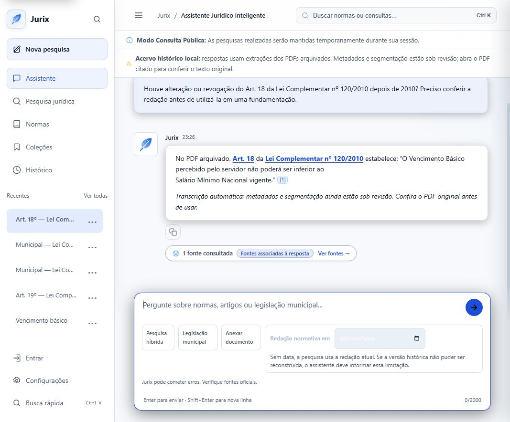

# Jurix — prontidão para o uso descrito pela PGM

Data: 07/10/2026. Avaliação do checkout local, incluindo trabalho não commitado. Esta avaliação não implementa mudanças nem aprova juridicamente documentos.

## Conclusão e nota

**Prontidão para o uso da PGM descrito pelo professor: 5,0/10.** O Jurix já consulta PDFs, identifica dispositivos, fornece citações e possui infraestrutura de relações e projeção temporal. Ainda não demonstra, em cadeias jurídicas reais revisadas, que consegue avisar ao assessor que o artigo usado numa fundamentação foi alterado ou revogado e mostrar a redação aplicável à data escolhida.

**Base de engenharia: aproximadamente 7,5/10.** É outra régua: implementação e testes não equivalem à cobertura do acervo nem à validação jurídica. A diferença para notas anteriores de MVP demonstrável não significa regressão; aqui o critério é o trabalho efetivo da PGM, e não o funcionamento do chat em QA.

**Validade científica: não avaliada.** Sem gold humano adjudicado, não atribuir precisão jurídica, recall de alterações ou ganho do grafo a um número de testes de software.

Rubrica qualitativa explícita, não benchmark: cobertura/identidade do corpus (peso 20%, nota 5); relações/temporalidade (25%, nota 6); conferência de fundamentação existente (20%, nota 2); pesquisa temática/grafo (15%, nota 5); rastreabilidade do assistente (10%, nota 7); operação/atualização (10%, nota 6). Soma ponderada 4,95, arredondada para 5,0. Relações e operação recebem crédito pela infraestrutura existente, não por cobertura jurídica demonstrada.

## O que o professor pediu de fato

Fonte privada lida integralmente: transcrição fornecida da reunião de 02/10/2026; SHA-256 `E374B82703EAC11F66696B0C020608ACC67CE4A168A6DE9A2C86A03CDC96CBD8`. Não reproduzir assuntos pessoais nem a transcrição completa no repositório.

- **06:18–07:23 / 16:55–19:00:** encontrar legislação por tema e explorar conexões, selecionando normas relevantes. O grafo serve a uma pergunta, não é decoração.
- **07:23–08:45:** abrir no documento o dispositivo citado, inclusive inciso; preservar a indicação de veto e o histórico, não apagar texto histórico silenciosamente.
- **08:45–10:50:** ligar norma antiga, norma modificadora e artigo afetado, mantendo texto anterior, novo texto, datas e origem.
- **10:50–12:27:** conferir a fundamentação reutilizada em peças/pareceres, para não citar uma redação superada sem perceber. Este é o principal fluxo de valor para a PGM.
- **12:27–14:42:** fazer uma passagem inicial no acervo para resolver relações e, depois, processar novos atos incrementalmente.
- **14:42–15:58:** acompanhar o Diário Oficial e distinguir leis ordinárias, complementares e decretos.
- **15:58–16:55:** extrair identidade da epígrafe antes de limpar cabeçalhos. O nome do arquivo é indício, não autoridade suficiente para resolver conflitos.

Isso não autoriza decidir automaticamente a lei aplicável aos fatos, afirmar validade de precedente/jurisprudência, interpretar revogação tácita como certeza nem enviar peças confidenciais a provedores externos.

## Estado local e método

- Branch `main`, HEAD `ab6c172`; 142 arquivos rastreados já modificados; index sem alterações; nenhum commit pendente em relação ao upstream local registrado. Não houve fetch, switch, commit, push ou merge. O remoto não foi usado como fonte do estado do projeto.
- A avaliação considera o working tree, não apenas esse commit. Há numerosos documentos e módulos novos não rastreados preexistentes; não foram removidos, renomeados ou sobrescritos.
- Inspeção de código, planos anteriores e ledger de entrega; navegação real na QA isolada `http://127.0.0.1:8026`, que usa o código deste checkout. A porta 8010 no contexto do usuário não foi presumida atual.
- A QA apresenta **40 PDFs históricos autênticos pendentes e 0 normas consolidadas nesta instância**. Isso não prova que todos os bancos do projeto tenham zero normas. Não consultei nem modifiquei o banco real.
- Inventário anterior documenta 6.663 PDFs (4.635 decretos, 1.765 leis ordinárias, 234 complementares, 29 promulgadas) no ZIP do professor. São arquivos, não necessariamente normas únicas. Esses números vêm de `JURIX_NORMATIVE_GRAPH_IMPLEMENTATION_PLAN.md`, não de nova contagem do ZIP nesta avaliação.

## Evidências e lacunas prioritárias

### PGM-01 — o chat não responde à pergunta sobre superação da redação

**Severidade: alta; verificado em runtime e código.** Pergunta: “Houve alteração ou revogação do Art. 18 da Lei Complementar nº 120/2010 depois de 2010? Preciso conferir a redação antes de utilizá-la em uma fundamentação.” A resposta final apenas transcreveu o artigo do PDF e avisou que a extração está em revisão. Não esclareceu que não conseguiu verificar a cadeia posterior. Screenshot: `../audit/screenshots/pgm-2026-10-07/article-change-query.jpg`.

O classificador já tem intenção relacional (`src/processing/normative_query.py:30`), mas o caminho de PDFs de QA recupera excertos e gera resposta textual (`src/processing/qa_archive_rag.py:944`, `:996`). A proteção temporal desse caminho depende de `temporal_scope_requested`; não basta para a pergunta relacional reproduzida. Correção: roteiro específico de alterações, com fonte do evento e cobertura, ou abstenção sobre mudanças acompanhada do texto original claramente identificado. Não basta melhorar o prompt.

### PGM-02 — o acervo real ainda não virou biblioteca utilizável de ponta a ponta

**Severidade: alta; runtime e código.** `/normas/` na QA mostrou 40 PDFs pendentes e nenhuma norma consolidada. O importador seleciona apenas os primeiros registros até o limite QA (`src/apps/ingestion/archive_import.py:203–214`); promoção só procura normas já existentes (`src/apps/ingestion/document_promotion.py:52`). Não há comprovação de uma execução completa sobre o ZIP.

Correção: inventário completo, staging retomável de todos os PDFs, cadastro revisado de identidades ausentes e publicação progressiva. Não remover limites QA para conseguir isso. PDFs pendentes podem ser pesquisáveis, mas não apresentados como redação vigente/consolidada.

### PGM-03 — classificação numérica legada pode exibir espécie errada

**Severidade: alta; leitura de código e consulta oficial, não erro visual reproduzido.** `src/apps/legislation/models.py:159–174` associa código 3 a Decreto, 5 a Emenda e 6 a Portaria; códigos numéricos desconhecidos viram Lei. O catálogo SAPL Natal consultado em 07/10/2026 associa 3 a Resolução, 5 a Decreto Legislativo e 6 a Emenda à Lei Orgânica. IDs são locais à instalação; não usar esse catálogo como enumeração universal.

Já existe adaptador com identidade bruta/catálogo (`src/clients/sapl/sapl_types.py`). Unificar a apresentação no adaptador, preservando origem e desconhecido. Não converter indiscriminadamente registros antigos sem saber qual catálogo os criou.

### PGM-04 — projeção técnica não prova cobertura jurídica do período

**Severidade: alta; código e documentação.** O motor exige original revisado e evidências de datas (`src/processing/normative_projection.py:102`, `:146–158`), o que é positivo. Entretanto, nenhuma cadeia real revisada foi demonstrada nesta avaliação. A ausência de eventos recuperados não prova ausência de alterações no mundo real. O ledger `NORMATIVE_GRAPH_DELIVERY.md` declara corpus pendente e ciência não avaliada.

Correção: contratos distintos para completude da execução, cobertura das fontes e reconstrução de uma cadeia. Exibir “nenhuma alteração encontrada no escopo verificado”, com corte temporal, em vez de certeza de vigência por omissão.

### PGM-05 — falta a tarefa central: conferir um texto já utilizado

**Severidade: alta; código.** `src/apps/legislation/workspace_urls.py` não oferece um fluxo de conferência de múltiplas referências em fundamentação. `src/apps/legislation/templates/legislation/norma_compare.html:25` informa expressamente que o modo de decisão não identifica automaticamente normas citadas nem avalia aplicabilidade do precedente.

Correção: colar texto, detectar referências com posições, pedir datas explícitas e retornar cada dispositivo com mudança, data, fonte, antes/depois ou impossibilidade de conferência. Primeiro MVP sem upload de Word e sem integração com processos reais.

### PGM-06 — exploração temática não reúne ainda o percurso do professor

**Severidade: média; runtime e código.** `/pesquisa/?q=ambiental+lixo` retornou zero resultados semânticos na amostra QA; isso não demonstra ausência no arquivo inteiro. Sugestões temáticas são candidatas por regras (`src/processing/normative_topics.py:11–32`). O grafo existente é centrado numa norma (`src/apps/legislation/relations_api.py`), não um espaço de seleção temática de vários documentos.

Correção: pesquisa híbrida com sinônimos controlados, filtros, seleção de normas e grafo/lista de relações verificáveis. Aresta temática não equivale a alteração, hierarquia ou fundamento de vigência.

### PGM-07 — limites por etapa e fronteira operacional precisam virar um pipeline completo

**Severidade: alta; código.** `src/apps/ingestion/normative_tasks.py:55` exige QA; a etapa de embeddings seleciona os dez primeiros dispositivos (`:172`). Uma execução bem-sucedida dessa fatia não demonstra indexação integral de uma norma longa. Há filas, leases e retomada: reutilizá-los, não criar um segundo pipeline concorrente.

Correção: cursores persistidos por etapa, conclusão baseada no universo esperado e perfil de piloto separado. O plano não autoriza ativar produção nem enfraquecer os guardrails QA.

### PGM-08 — atualização diária exige fontes e cobertura, não só cron

**Severidade: alta; código e fonte oficial.** Já existe schedule SAPL diário/semanal opt-in (`config/settings.py:241–259`) e sincronização com checkpoints (`src/apps/ingestion/sapl_sync.py`). Não afirmar que nada existe. Porém, o catálogo SAPL consultado não apresenta categoria de decreto executivo: Decreto Legislativo não substitui os milhares de decretos do arquivo.

O Diário Oficial publica edições ordinárias e especiais; a listagem oficial mostrou edição especial em 03/10/2026. Acompanhamento deve usar identidade da edição e conteúdo, não apenas uma URL/PDF por dia. Adapter DOM, processamento de alterações e alerta precisam ser verificáveis.

### PGM-09 — sem piloto jurídico e de usuários, nota 9 seria prematura

**Severidade: alta; documentação.** Existem ensaios técnicos e testes sintéticos, mas o ledger separa isso de gold humano. Não houve, nesta avaliação, entrevista/teste com assessor da PGM, comparação cronometrada com a rotina atual nem adjudicação jurídica das cadeias.

Correção: casos reais públicos selecionados por responsável jurídico, gold versionado e avaliação pareada. Peças reais/confidenciais somente após aprovação de tratamento de dados.

## O que manter

Django + templates + JavaScript modular; PostgreSQL/pgvector; Celery/Redis; Ollama local. Identidade documental, hashes, extrações imutáveis, snapshots, evidências de eventos, revisão, acesso ao PDF local, citações e cópia estruturadas são investimentos válidos. Grafo relacional em PostgreSQL atende ao piloto; não migrar para Neo4j ou frontend pesado só para desenhar conexões.

## Verificações desta avaliação e limites

- Transcrição integral lida; arquivos responsáveis inspecionados; catálogo SAPL consultado somente em leitura.
- Runtime: lista de normas/acervo, busca temática e pergunta específica sobre alteração/revogação com resposta final e citação PDF. Nenhuma aprovação/promoção de documento nem alteração de norma real.
- Nova regressão focal de classificador, referências, projeção e catálogo: **71 passed em 17,09 s**, zero falhas, usando `config.settings_normative_qa`. Comando: `.venv/Scripts/python.exe scripts/normative_qa.py --run python -m pytest -q --tb=short src/tests/test_normative_query.py src/tests/test_normative_projection.py src/tests/test_normative_reference.py src/tests/test_sapl_type_catalog.py`. Suítes integrais anteriores são evidências históricas no ledger, não novas execuções deste turno. A lacuna reproduzida no navegador não é coberta por esses testes passantes.
- Não auditado integralmente: WCAG, zoom nativo 200%, leitor de tela, todos os dispositivos do ZIP, deploy de produto, backup/restore e uso por servidores da PGM. HIG Apple teve conteúdo público não plenamente acessível; não certifico conformidade.
- A conversa anônima de teste foi criada apenas na QA local. Screenshot contém legislação pública e interface de teste, sem peça real, credencial ou dado pessoal.

## Referências verificadas

- [SAPL Natal — catálogo de tipos](https://sapl.natal.rn.leg.br/api/norma/tiponormajuridica/): consultado via GET local; IDs não são universais.
- [Diário Oficial de Natal](https://www2.natal.rn.gov.br/dom/) e [pesquisa oficial](https://www2.natal.rn.gov.br/dom/index.php?p=c): edição especial e ordinária precisam de identidades próprias. Contrato de API não verificado.
- [Interlegis — SAPL](https://www12.senado.leg.br/interlegis/produtos/sapl): registro e consulta legislativa; não presumir cobertura executiva integral.
- [LC federal nº 95/1998](https://planalto.gov.br/ccivil_03/leis/lcp/lcp95compilado.htm): princípios de estrutura, alteração, vigência e revogação explícita; não substitui revisão do regime municipal nem resolve datas automaticamente.
- [WCAG 2.2](https://www.w3.org/TR/WCAG22/): critérios para validação futura de teclado, reflow, foco, status e alvos. Alvo de 44 px é decisão de design do piloto, não requisito universal de AA.

## Próxima entrega que muda a nota

Uma demonstração da PGM deve começar com um texto antigo e terminar com uma conferência rastreável de um artigo realmente modificado — não com uma pergunta genérica respondida por um PDF. O plano associado cria esse caminho e mantém dados não revisados consultáveis sem convertê-los em certeza jurídica.

Plano: [JURIX_PGM_IMPLEMENTATION_PLAN.md](JURIX_PGM_IMPLEMENTATION_PLAN.md).

